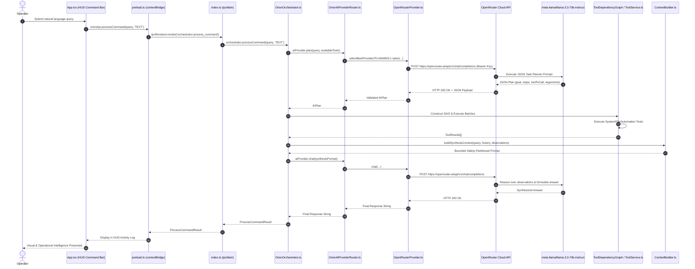

# ORION BRAIN RUNTIME TRACE & ARCHITECTURAL BLUEPRINT

**System Target**: ORION AI Desktop Command Center  
**Environment**: Production Main / Renderer Isolation  
**Date**: 2026-09-08  
**Verification Level**: PROVEN RUNTIME PATH  

---

## 1. Trace Matrix: The 11 Core Questions

| # | Architectural Question | Answer / Source Location | Proven Behavior |
|---|------------------------|--------------------------|-----------------|
| **1** | **Where is `AIProvider` defined?** | [`src/main/services/AIProvider.ts`](file:///C:/Users/smsaq/Downloads/ORION/src/main/services/AIProvider.ts) | Defines `IAIProvider` contract (`chat`, `stream`, `classifyIntent`, `plan`, `analyzeImage`), `ProviderStatus`, `IntentClassification`, `AIPlan`, and `LocalHeuristicAIProvider`. |
| **2** | **Where is `OrionAIProviderRouter` instantiated?** | [`src/main/index.ts`](file:///C:/Users/smsaq/Downloads/ORION/src/main/index.ts#L33) (`const omniRouter = new OrionAIProviderRouter();`) | Instantiated once at startup in the Electron Main process and passed into `OrionOrchestrator`, `ComputerUseService`, and `CloudVisionAdapter`. |
| **3** | **Where are `ProviderAdapters` instantiated?** | [`src/main/services/OrionAIProviderRouter.ts`](file:///C:/Users/smsaq/Downloads/ORION/src/main/services/OrionAIProviderRouter.ts#L160-L170) | Instantiated inside the router constructor: `OpenRouterProvider`, `GroqProvider`, `GeminiProvider`, `GitHubModelsProvider`, `CerebrasProvider`, `MistralProvider`, `NVIDIAProvider`, `DeepSeekProvider`, `CloudflareProvider`. |
| **4** | **How are credentials loaded?** | [`src/main/services/ProviderAdapters.ts`](file:///C:/Users/smsaq/Downloads/ORION/src/main/services/ProviderAdapters.ts#L83-L92) via `dotenv` from `.env` | `reloadCredentials()` queries `process.env[this.config.envKeyName]`. In `OpenRouterProvider`, `envKeyName = 'OPENROUTER_API_KEY'`. |
| **5** | **How is provider/model config loaded?** | [`src/main/services/ProviderAdapters.ts`](file:///C:/Users/smsaq/Downloads/ORION/src/main/services/ProviderAdapters.ts#L684-L699) and `.env` | `process.env.OPENROUTER_MODEL || 'meta-llama/llama-3.3-70b-instruct'`. Configured through `ModelRegistry` and `.env`. |
| **6** | **Which provider does ORION select by default?** | [`src/main/services/OrionAIProviderRouter.ts`](file:///C:/Users/smsaq/Downloads/ORION/src/main/services/OrionAIProviderRouter.ts#L209-L272) | **OpenRouter AI Cloud** (`openrouter`). Given `SPEED_FIRST` / `AGENT` routing strategies, OpenRouter receives top capability and weight bonuses (+50 to +60 points). |
| **7** | **Which model does ORION select?** | `meta-llama/llama-3.3-70b-instruct` | Configured in `OPENROUTER_MODEL` and registered as primary high-context multimodal instruction engine in `ModelRegistry`. |
| **8** | **Does renderer reach the AI provider through IPC?** | **YES**. [`src/renderer/App.tsx`](file:///C:/Users/smsaq/Downloads/ORION/src/renderer/App.tsx#L137) → [`src/main/preload.ts`](file:///C:/Users/smsaq/Downloads/ORION/src/main/preload.ts#L8) (`orchestrator:process_command`) → [`src/main/index.ts`](file:///C:/Users/smsaq/Downloads/ORION/src/main/index.ts#L100) | Secure IPC bridge forwards queries from UI directly to `orchestrator.processCommand(query, source)`. |
| **9** | **Does `OrionOrchestrator` send user requests to the AI provider?** | **YES**. [`src/main/services/OrionOrchestrator.ts`](file:///C:/Users/smsaq/Downloads/ORION/src/main/services/OrionOrchestrator.ts#L191) (`aiProvider.plan(...)`) and [L355/L363](file:///C:/Users/smsaq/Downloads/ORION/src/main/services/OrionOrchestrator.ts#L355) (`aiProvider.chat(...)`) | User queries invoke OpenRouter to generate autonomous execution plans and synthesize final context-bounded responses. |
| **10** | **Are tool calls generated by the model or hardcoded?** | **GENERATED BY THE REAL OPENROUTER MODEL**. [`src/main/services/ProviderAdapters.ts`](file:///C:/Users/smsaq/Downloads/ORION/src/main/services/ProviderAdapters.ts#L758-L844) | OpenRouter LLM evaluates the available tool set and emits a JSON plan with exact `toolToCall`, `toolArguments`, and dependency prerequisites. |
| **11** | **Can fallback/heuristic silently replace the real model?** | **NO**. Deterministic failover only activates if all configured cloud providers fail or return 401/429/500 errors. When fallback activates, responses explicitly prefix `[OFFLINE MODE]` and emit `ai.failover.started` / `ai.provider.failed` events. |

---

## 2. Complete End-to-End Runtime Chain

---

## 3. Function & File Mapping Reference

1. **USER INPUT → ORION UI**:
   * File: [`src/renderer/App.tsx`](file:///C:/Users/smsaq/Downloads/ORION/src/renderer/App.tsx)
   * Function: `handleCommandSubmit(e)`
2. **ORION UI → PRELOAD**:
   * File: [`src/main/preload.ts`](file:///C:/Users/smsaq/Downloads/ORION/src/main/preload.ts)
   * Function: `api.processCommand(query, source)`
3. **PRELOAD → IPC**:
   * Channel: `'orchestrator:process_command'`
4. **IPC → ORCHESTRATOR**:
   * File: [`src/main/index.ts`](file:///C:/Users/smsaq/Downloads/ORION/src/main/index.ts)
   * Function: `ipcMain.handle('orchestrator:process_command', ...)`
5. **ORCHESTRATOR → AI ROUTER**:
   * File: [`src/main/services/OrionOrchestrator.ts`](file:///C:/Users/smsaq/Downloads/ORION/src/main/services/OrionOrchestrator.ts)
   * Function: `processCommand(query, source)` calling `this.aiProvider.plan()` and `this.aiProvider.chat()`
6. **AI ROUTER → PROVIDER ADAPTER**:
   * File: [`src/main/services/OrionAIProviderRouter.ts`](file:///C:/Users/smsaq/Downloads/ORION/src/main/services/OrionAIProviderRouter.ts)
   * Function: `selectBestProvider(category)` routing to `OpenRouterProvider`
7. **PROVIDER ADAPTER → OPENROUTER CLOUD**:
   * File: [`src/main/services/ProviderAdapters.ts`](file:///C:/Users/smsaq/Downloads/ORION/src/main/services/ProviderAdapters.ts)
   * Functions: `OpenRouterProvider.plan()` & `OpenAICompatibleAdapter.chat()`
8. **CLOUD → MODEL**:
   * Endpoint: `https://openrouter.ai/api/v1/chat/completions`
   * Model: `meta-llama/llama-3.3-70b-instruct`
9. **MODEL RESPONSE → ORION TOOL EXECUTION**:
   * Files: [`src/main/services/ExecutionContext.ts`](file:///C:/Users/smsaq/Downloads/ORION/src/main/services/ExecutionContext.ts) and [`src/main/services/ToolService.ts`](file:///C:/Users/smsaq/Downloads/ORION/src/main/services/ToolService.ts)
   * Functions: `ToolDependencyGraph.getExecutableBatches()` & `ToolService.executeTool(call)`
10. **TOOL RESULTS → OBSERVATION & CONTEXT**:
    * File: [`src/main/services/ContextBuilder.ts`](file:///C:/Users/smsaq/Downloads/ORION/src/main/services/ContextBuilder.ts)
    * Function: `buildSynthesisContext(query, history, observations)`
11. **FINAL REASONING → UI PRESENTATION**:
    * Model synthesizes final answer with untrusted boundary enforcement; returned to Electron renderer for display.
