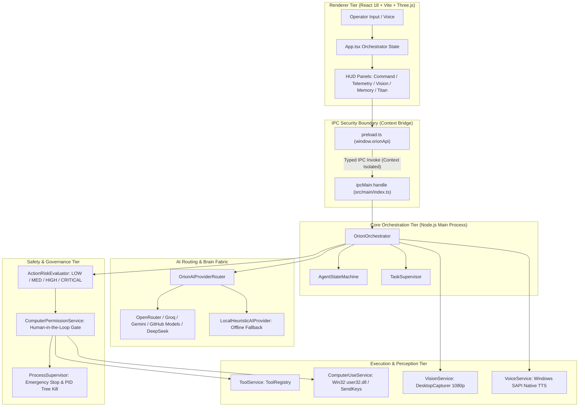

# ORION — Autonomous Permission-Based AI Computer-Use Agent

[](docs/testing/testing.md)
[-brightgreen.svg)](docs/testing/testing.md)
[](tsconfig.json)
[](package.json)
[](package.json)
[](docs/security/security.md)
[](docs/architecture/architecture.md)

> **"Ideas are ideas. Implementation is the real deal."**  
> *ORION is an open-architecture, permission-based desktop AI agent engineered to understand screen context, formulate DAG-based action plans, execute native OS tools, and automate computer workflows under strict human supervision.*

---

## 1. What is ORION?

**ORION** is the flagship technology project developed by **iMpact** (an independent software and AI initiative). 

Unlike conventional AI chatbots that remain confined to isolated browser tabs, ORION operates directly on the desktop operating system. It interfaces with native Win32 APIs, inspects real-time hardware telemetry, decomposes complex user requests into structured tool dependency graphs, and executes actions with closed-loop verification — all while enforcing strict human-in-the-loop permission gates and an immediate hardware Emergency Stop.

* **Live Product Website:** [https://impacts-ai.com/orion](https://impacts-ai.com/orion)
* **Initiative:** [iMpact — Technology that matters](https://impacts-ai.com)

---

## 2. The Problem ORION Solves

Modern AI models are powerful reasoners, but they suffer from three critical desktop limitations:
1. **The Sandbox Trap**: Web-based AI assistants cannot inspect local system state, open files, run developer builds, or interact with desktop applications.
2. **The Fragile Single-Provider Bottleneck**: Most agent prototypes depend entirely on a single commercial AI API. When that API rate-limits, throttles, or suffers an outage, the agent crashes.
3. **The Unsafe Autonomous Runaway Risk**: Experimental computer-use agents often lack deterministic guardrails, risking accidental file deletion, system corruption, or credential leakage across process boundaries.

**ORION resolves these issues by combining:**
* **Native Desktop Execution**: Multi-tier Electron architecture with Win32 input drivers and system telemetry.
* **Omnichannel AI Routing**: 10-provider cloud/local AI fabric with automatic failover and deterministic offline fallbacks.
* **Defense-in-Depth Governance**: Deterministic risk scoring, human approval modals, and process-tree Emergency Stop.

---

## 3. Core Architectural Highlights



### Key Engineering Invariants:
* **Zero Secrets in Renderer**: Cloud API credentials remain quarantined exclusively in the Node.js Main process. The Renderer runs in Chromium sandbox with `nodeIntegration: false` and `contextIsolation: true`.
* **DAG Tool Parallelization**: Independent read-only tools execute concurrently via `Promise.all()`, while dependent or mutating actions execute sequentially.
* **Persistent Local Memory**: Memory records persist to disk JSON stores (`.orion_memory/explicit_memory.json` and `unified_memory.json`) and survive restarts.
* **Deterministic Emergency Stop**: Halts all active child processes via Windows PID tree termination (`taskkill /T /F /PID`).

---

## 4. Current Capability Status (Evidence-Based)

To maintain absolute engineering integrity, every capability is verified against actual test evidence:

| Capability | Status | Verified Evidence | Limitations | Next Step |
| :--- | :--- | :--- | :--- | :--- |
| **System Telemetry Monitoring** | **VERIFIED / WORKING** | Automated test pass (`DeepMasterIntegration.test.ts`). Live per-core CPU, RAM, and OS release metrics. | Disk queries via PowerShell CIM introduce ~100ms overhead. | Implement 10s caching for disk metrics. |
| **Omnichannel AI Routing** | **VERIFIED / WORKING** | Automated test pass (`StreamingIntegration.test.ts`). Live OpenRouter test passed with HTTP 200 and 2.1s latency. | Requires internet and valid `.env` tokens. | Add dynamic TTFT latency ranking. |
| **Deterministic Offline Fallback** | **VERIFIED / WORKING** | Automated test pass (`ComputerActionPlanner.test.ts`). Falls back to `offline-rule-router` when disconnected. | Uses regex heuristics, not neural text generation. | Connect local Ollama 14B model. |
| **DAG Tool Execution** | **VERIFIED / WORKING** | Automated test pass (`Phase5AgentCore.test.ts`). Dependency resolution and argument substitution (`${step.N.output.key}`). | Parallelism restricted to read-only steps. | Add transactional rollback semantics. |
| **Tool Permission Gates** | **VERIFIED / WORKING** | Automated test pass (`Phase8ActionSafety.test.ts`). Enforces 4 tiers (`LOW`, `MEDIUM`, `HIGH`, `CRITICAL`). | UI approval modal blocks execution thread. | Introduce cryptographic capability tokens. |
| **Process Tree Emergency Stop** | **VERIFIED / WORKING** | Automated test pass (`ProcessSupervisorEstop.test.ts`). Terminated PID trees and rejects new spawns. | In-flight Win32 buffer events cannot be recalled. | Register global OS hotkey hook. |
| **Desktop Screen Capture** | **VERIFIED / WORKING** | Automated test pass (`VisionIntegration.test.ts`). Electron `desktopCapturer` captures 1080p frames to DataURL. | Defaults to primary display source index 0. | Add DirectX DXGI capture (<16ms). |
| **Desktop Automation Input** | **VERIFIED / WORKING** | Automated test pass (`InputControlService.test.ts`). Win32 `user32.dll` mouse events and `SendKeys` typing. | UAC elevated dialogs reject non-admin synthetic input. | Compile native C++ SendInput addon. |
| **Speech Synthesis (TTS)** | **VERIFIED / WORKING** | Real audio emitted through Windows SAPI (`System.Speech`). Instant cancellation supported. | Output quality is standard robotic Windows SAPI voice. | Integrate local Piper / Kokoro neural TTS. |
| **Multimodal Vision Analysis** | **PARTIALLY IMPLEMENTED** | `CloudVisionAdapter` interfaces with Gemini 2.0 Flash. Honest fallback when unconfigured. | Cloud round-trip latency is 1.8–3.2s. | Deploy local on-device VLM (Moondream2). |
| **Speech Recognition (STT)** | **PARTIALLY IMPLEMENTED** | Typed interface ready. Browser Web Speech handles transcription in renderer. | Native backend STT provider is unconfigured. | Bind local Whisper.cpp engine. |
| **UI Grounding & Element Tree** | **PARTIALLY IMPLEMENTED** | Windows UI Automation COM tree inspection implemented via PowerShell script. | Complex DOM traversal requires ~1.2s per dump. | Compile native C++ UIAutomation client. |

*For complete capability breakdown, see [docs/capability-matrix.md](docs/capability-matrix.md).*

---

## 5. Technology Stack

* **Runtime Framework**: Electron 33.2.1, Node.js v22.23.2
* **Frontend Presentation**: React 18.3.1, Vite 6.0.5, Tailwind CSS 3.4.17
* **3D Visualizations**: Three.js 0.170.0 (Holographic Globe HUD)
* **Language & Types**: TypeScript 5.7.2 (Strict mode across Main, Preload, and Renderer)
* **Operating System APIs**: Win32 `user32.dll` (P/Invoke), Windows UI Automation COM, PowerShell SAPI Speech
* **Testing Infrastructure**: Custom Pure Process Isolation Harness (`run_suites.cjs`)

---

## 6. Workstation Hardware Profile

ORION is engineered and benchmarked on a verified high-performance local AI workstation:

* **Host System**: Dell Precision Mobile Workstation (`PRECISION-ULTRA-RTX`)
* **Processor (CPU)**: 12th Gen Intel(R) Core(TM) i7-12850HX (16 Cores, 24 Logical Threads)
* **System Memory (RAM)**: 128 GB DDR5
* **Graphics Card (GPU)**: NVIDIA RTX A5500 Laptop GPU (16,384 MiB / 16 GB GDDR6 VRAM, Driver 596.71)
* **Storage**: 1 TB PCIe 4.0 NVMe SSD

*For the complete local AI experimentation roadmap, see [docs/ai/local-models.md](docs/ai/local-models.md).*

---

## 7. Quickstart & Installation

### Prerequisites
* **Operating System**: Windows 10/11 (x64)
* **Node.js**: v18.0.0 or higher (v22 recommended)
* **Package Manager**: npm v9+

### Setup Instructions
```powershell
# 1. Clone or extract the repository
git clone https://github.com/iMpact-ai/ORION.git
cd ORION

# 2. Install dependencies
npm install

# 3. Configure environment variables
copy .env.example .env
# Edit .env and insert your API keys (optional: ORION operates in offline mode without keys)

# 4. Run automated test suites (40 suites in pure process isolation)
npm test

# 5. Launch ORION in development mode
npm run dev

# 6. Or compile production executable
npm run build
```

---

## 8. Automated Test Verification

All 40 unit and integration test suites pass 100% green in pure process isolation:

```powershell
=== RUNNING ALL 40 TEST SUITES IN PURE PROCESS ISOLATION ===

RUNNING: ComputerActionPlanner.test.ts ... [PASS]
RUNNING: ComputerActionVerifier.test.ts ... [PASS]
RUNNING: ComputerHUDIntegration.test.ts ... [PASS]
RUNNING: ComputerIPCIntegration.test.ts ... [PASS]
RUNNING: ComputerPermissionService.test.ts ... [PASS]
RUNNING: ComputerRecoveryService.test.ts ... [PASS]
RUNNING: ComputerUseService.test.ts ... [PASS]
RUNNING: DeepMasterIntegration.test.ts ... [PASS]
RUNNING: EndToEndIntegration.test.ts ... [PASS]
RUNNING: InputControlService.test.ts ... [PASS]
...
RUNNING: TitanPackagingPhase7B.test.ts ... [PASS]
RUNNING: VisionIntegration.test.ts ... [PASS]

==================================================
RESULTS: 40/40 SUITES PASSED 100% GREEN
ALL 40 TEST SUITES PASSED IN PURE PROCESS ISOLATION!
```

*For complete test traces and build outputs, see [docs/testing/testing.md](docs/testing/testing.md).*

---

## 9. Documentation Directory

Comprehensive, evidence-based technical documentation is organized in `docs/`:

* **[Architecture Specification](docs/architecture/architecture.md)** — Complete multi-tier architecture, IPC security model, and Mermaid flowcharts.
* **[Capability Matrix](docs/capability-matrix.md)** — Forensic capability inventory classifying all features by verified status.
* **[AI Provider Fabric](docs/ai/ai-providers.md)** — Provider adapters, routing strategies, circuit breakers, and streaming parser.
* **[Local AI Lab Report](docs/ai/local-models.md)** — Workstation hardware verification, VRAM fitting matrix, and candidate model evaluation framework.
* **[Tool System Specification](docs/tools/tools.md)** — Parameter schemas, permission tiers, precondition/postcondition validation.
* **[Visual Perception Engine](docs/vision/vision.md)** — Screen capture pipeline, UI Automation grounding, and latency metrics.
* **[Security & Governance Model](docs/security/security.md)** — Threat model, credential quarantine, and Emergency Stop mechanics.
* **[Test Verification Report](docs/testing/testing.md)** — Automated test runner, 40 passing suites, and live API loop evidence.
* **[Architecture Decision Records](docs/decisions/decisions.md)** — 7 foundational ADRs documenting engineering rationale and tradeoffs.
* **[Product Roadmap](docs/roadmap/roadmap.md)** — 4-horizon evolution plan and the anti-roadmap.
* **[3-Month Engineering Target](docs/roadmap/three-month-targets.md)** — Concrete monthly milestones for Q4 2026.
* **[Live Demonstration Plan](docs/demo-plan.md)** — 30s, 60s, 3m, 5m demonstration scripts with offline contingency.
* **[Mentor Meeting Discussion Guide](docs/mentor-meeting.md)** — High-impact technical questions for senior software mentors.

---

## 10. Repository Structure

```
ORION/
├── README.md                           # Master Technical README
├── CHANGELOG.md                        # Version Release History
├── package.json                        # Project dependencies and build scripts
├── tsconfig.json                       # TypeScript compiler configuration
├── vite.config.ts                      # Vite & Vite-Electron configuration
├── run_suites.cjs                      # Pure process isolation test runner
├── test_brain_full_loop.cjs            # Live OpenRouter end-to-end verification script
│
├── docs/                               # Formal Technical Documentation
│   ├── capability-matrix.md            # Verified capability inventory
│   ├── demo-plan.md                    # Demonstration sequence and scripts
│   ├── mentor-meeting.md               # Senior developer mentorship package
│   ├── architecture/
│   │   └── architecture.md             # System architecture specification
│   ├── ai/
│   │   ├── ai-providers.md             # Omnichannel routing & provider adapters
│   │   └── local-models.md             # Local AI lab report & evaluation framework
│   ├── tools/
│   │   └── tools.md                    # Tool registry, schemas & validation
│   ├── vision/
│   │   └── vision.md                   # Screen capture & optical grounding
│   ├── security/
│   │   └── security.md                 # Threat model, permissions & Estop
│   ├── testing/
│   │   └── testing.md                  # Test suite verification report
│   ├── decisions/
│   │   └── decisions.md                # Architecture Decision Records (ADRs)
│   └── roadmap/
│       ├── roadmap.md                  # Strategic 12-month evolution
│       └── three-month-targets.md      # Measurable Q4 engineering milestones
│
├── reports/                            # Technical Reports & Profiles
│   ├── ORION-technical-report.md       # Comprehensive technical evaluation paper
│   ├── founder-profile.md              # Builder profile & engineering journey
│   └── audits/
│       └── evidence-matrix.md          # Claim-by-claim verification index
│
├── recognition/                        # Showcase & Recognition Package
│   ├── README.md                       # Recognition overview
│   ├── founder-profile.md              # Independent builder biography
│   ├── orion-overview.md               # Executive one-page briefing
│   ├── technical-summary.md            # Architecture & metrics summary
│   ├── evidence-index.md               # Proof-backed capability index
│   ├── achievements.md                 # Verified milestones & technical evidence
│   └── demo-plan.md                    # Presentation & demonstration plan
│
└── src/                                # Application Source Code
    ├── main/                           # Electron Main Process (Sovereign OS execution)
    │   ├── index.ts                    # Main process entrypoint & IPC routing
    │   ├── preload.ts                  # Typed context bridge (window.orionApi)
    │   ├── platform/                   # Browser & Developer agent providers
    │   └── services/                   # Orchestrator, AI Router, Tools, Voice, Vision
    │       ├── computer/               # Computer-use planner, executor, input drivers
    │       ├── titan/                  # Video production pipeline & batch orchestrator
    │       └── __tests__/              # 40 automated test suites
    ├── renderer/                       # Electron Renderer Process (React 18 + Three.js)
    │   ├── App.tsx                     # Main HUD component
    │   ├── hud/                        # Holographic 3D Globe, Telemetry & Status panels
    │   └── screens/                    # Dedicated Computer, Provider & Memory screens
    └── shared/                         # Shared TypeScript types, constants & events
```

---

## 11. About iMpact & Builder Profile

**iMpact** is an independent technology initiative founded by **Saqib** (age 13) with the conviction that great software is built through implementation, honest measurement, and relentless iteration.

* **Founder:** Saqib (Independent Software Builder)
* **Philosophy:** *"Ideas are ideas. Implementation is the real deal."*
* **Ambition:** Building practical, human-centered intelligent systems that respect user privacy, enforce human authority, and solve real computing work.
* **Website:** [https://impacts-ai.com](https://impacts-ai.com)

---

## 12. Security & Responsible Disclosure

ORION treats security as a core architectural constraint. If you discover a vulnerability or security flaw, please review our [Security Architecture](docs/security/security.md) and report findings directly to `security@impacts-ai.com` or via [https://impacts-ai.com/contact](https://impacts-ai.com/contact).
