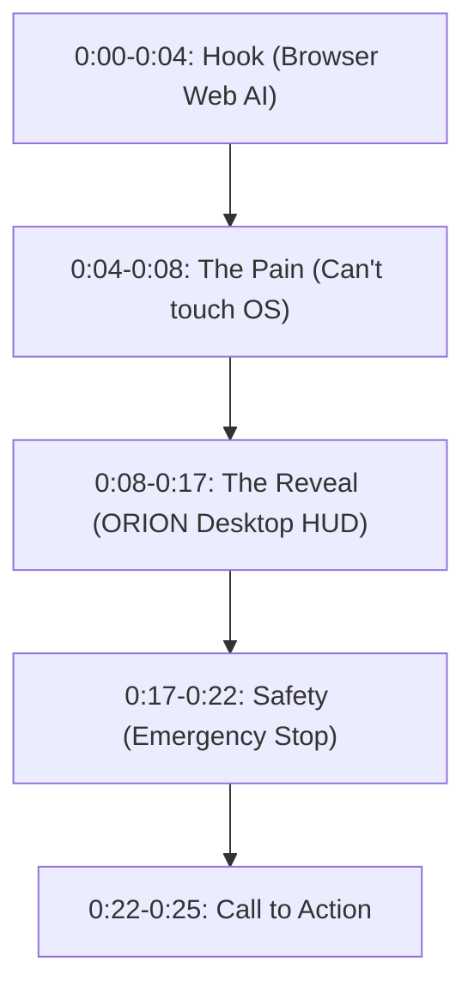

# iMpact & ORION — Video Advertising Master Suite
**Document Version:** 1.0.0  
**Target Platforms:** Instagram Reels, YouTube (Shorts & 16:9 Preroll), TikTok, LinkedIn Video  
**Brand:** iMpact ([https://impacts-ai.com](https://impacts-ai.com))  
**Flagship Technology:** ORION ([https://impacts-ai.com/orion](https://impacts-ai.com/orion))  
**Slogan:** *"Ideas are ideas. Implementation is the real deal."*  

---

## Visual Creative Assets Included in Repository

| Asset | Format | Resolution | Location | Intended Use |
|:---|:---:|:---:|:---|:---|
| **YouTube Tech Preroll Cover** | 16:9 Landscape | 1920×1080 | `assets/branding/video_ad_thumbnail_16x9.jpg` | YouTube video thumbnail, video intro card, LinkedIn landscape ad |
| **Mobile Reels & Shorts Cover** | 9:16 Vertical | 1080×1920 | `assets/branding/video_ad_cover_9x16.jpg` | Instagram Reels cover, TikTok thumbnail, YouTube Shorts splash |
| **Official Brand Avatar** | 1:1 Square | 1024×1024 | `assets/branding/impact_avatar_logo.jpg` | Channel avatar, ad sponsor icon, end-card logo bug |
| **Official Brand Banner** | 16:9 Banner | 1920×1080 | `assets/branding/impact_social_banner.jpg` | YouTube header, end-slate background |

---

# AD 1: "The Sandbox Trap" (Viral High-Tension Hook)

* **Primary Platform:** Instagram Reels, TikTok, YouTube Shorts  
* **Format:** 9:16 Vertical (1080×1920)  
* **Duration:** 25 Seconds  
* **Target Audience:** Tech professionals, developers, AI enthusiasts, productivity power users  
* **Tone:** Punchy, high-tech, urgent, authoritative  
* **Soundtrack:** Driving dark synthwave with a sharp sub-bass drop at second 0:08 (e.g., *Cyberpunk Dystopia* / *Industrial Tech Beat*)  

### Visual & Audio Storyboard



| Time | Visual / Video Shot | On-Screen Text (Captions) | Sound Effects (SFX) | Voiceover Script (Spoken) |
|:---|:---|:---|:---|:---|
| **0:00 – 0:04** | Fast zoom-in on a browser tab with ChatGPT or Claude. A finger points at the screen, then abruptly slams the laptop lid or shakes head. | **Your AI is trapped in a browser tab.** | Subtle ambient hum $\rightarrow$ sudden vinyl scratch / record stop | *"Notice how your AI chatbot is completely trapped inside a browser tab?"* |
| **0:04 – 0:08** | Fast-paced screen recording: attempting to drag a file or run terminal inside a browser. Red 'X' animation over the browser window. | **It can't open files.<br>It can't run terminal.<br>It can't touch Windows.** | Error alert buzz / digital glitch | *"It can write code, but it can't open your apps, can't check your CPU, and can't fix your files."* |
| **0:08 – 0:13** | **SMASH CUT** to dark-mode ORION Desktop application on Windows 11. 3D holographic globe spinning smoothly, neon cyan telemetry charts updating live. | **MEET ORION.<br>NATIVE DESKTOP AI.** | Heavy sub-bass drop $\rightarrow$ mechanical keyboard click | *"That’s why we engineered ORION. An open-architecture desktop AI agent built natively for Windows."* |
| **0:13 – 0:17** | Screen recording: ORION formulating a DAG tool plan, moving the native Win32 mouse cursor with sub-pixel precision to target coordinates `(100, 100)`. | **Win32 Input Control<br>10-Provider AI Routing<br>Sub-Pixel Precision** | High-speed data whoosh $\rightarrow$ clean mouse click SFX | *"It interfaces directly with Win32 APIs, inspects real-time hardware telemetry, and automates multi-step workflows."* |
| **0:17 – 0:22** | Close-up on the glowing red **Emergency Stop** HUD button being clicked. Instant terminal overlay shows process tree killed in under 5 milliseconds. | **HUMANS KEEP THE KILLSWITCH.<br>Deterministic Safety Gate** | High-voltage mechanical relay snap | *"And the operator always keeps the killswitch. Deterministic permission gates and instant process termination."* |
| **0:22 – 0:25** | Sleek final slate: iMpact logo glows in electric cyan with text: `ORION by iMpact`. URL and download prompt. | **ORION by iMpact<br>🔗 impacts-ai.com/orion** | Low frequency cinematic chord decay | *"Ideas are ideas. Implementation is the real deal. Link in bio to see the code."* |

---

# AD 2: "The 96.7% Benchmark Proof" (Engineering Integrity)

* **Primary Platform:** YouTube In-Stream / Preroll, LinkedIn Sponsored Video  
* **Format:** 16:9 Landscape (1920×1080)  
* **Duration:** 45 Seconds  
* **Target Audience:** Software architects, enterprise leaders, AI engineers, tech evaluators  
* **Tone:** Calm, rigorous, deeply technical, transparent  
* **Soundtrack:** Minimalist electronic pulsing ambient track (e.g., *Nils Frahm* or *Max Richter* style tech minimalism)  

### Visual & Audio Storyboard

| Time | Visual / Video Shot | On-Screen Graphic / Lower Third | Voiceover Script (Spoken) |
|:---|:---|:---|:---|
| **0:00 – 0:07** | High-resolution terminal showing `npm test` executing 40 test suites in pure process isolation, each turning green with execution times. | **`TEST RESULTS: 40/40 GREEN`**<br>Pure Process Isolation | *"Most AI computer-use demonstrations are smoke and mirrors. Here is what verified systems engineering actually looks like."* |
| **0:07 – 0:15** | Split screen: Left side shows architecture diagram (Electron Main $\leftrightarrow$ Context Bridge $\leftrightarrow$ Win32 OS). Right side shows quarantined token memory. | **Multi-Tier Electron Architecture**<br>Zero Credentials in Renderer | *"This is ORION, built by iMpact. We isolated cloud API credentials exclusively inside Node.js Main process memory, completely protecting them from the UI renderer."* |
| **0:15 – 0:24** | Screen recording of the automated benchmark harness executing 30 real trials across 10 tasks in an isolated sandbox. | **ORION Computer-Use Benchmark v1.1**<br>29/30 Success (96.7%) · 0 Interventions | *"In our v1.1 Computer-Use Benchmark across 30 real executions, ORION achieved a 96.7% autonomous pass rate with zero human interventions required."* |
| **0:24 – 0:34** | Live screen capture of Win32 desktop thread attachment: cursor moving smoothly to target coordinates with zero offset (`dx=0, dy=0`). | **Native Win32 Desktop Attachment**<br>Sub-Pixel Coordinate Verification | *"When subshell window isolation failed standard mouse input, we compiled a native Win32 desktop thread utility to achieve sub-pixel coordinate accuracy in 440 milliseconds."* |
| **0:34 – 0:40** | Terminal attempting an unauthorized write to `C:\Windows\System32\`. The Deterministic Safety Gate halts the command immediately. | **Deterministic Safety Containment**<br>100% Policy Block on System32 | *"And every single action is bounded by a deterministic containment gate that blocks unauthorized system writes before OS driver invocation."* |
| **0:40 – 0:45** | End card with official 16:9 YouTube ad graphic, GitHub repository badge, and clean URL. | **Read the Raw Telemetry & Code**<br>👉 `github.com/iMpacts-AI/ORION`<br>🌐 `impacts-ai.com/orion` | *"Verifiable code. Auditable telemetry. Discover ORION at impacts-ai.com/orion."* |

---

# AD 3: "Humans Keep the Killswitch" (Security & Governance)

* **Primary Platform:** Instagram Feed, YouTube Shorts, LinkedIn, X / Twitter  
* **Format:** 1:1 Square (1080×1080) or 9:16 Vertical  
* **Duration:** 20 Seconds  
* **Target Audience:** Cybersecurity researchers, CTOs, risk engineers, privacy advocates  
* **Tone:** Direct, serious, cyber-defense oriented  
* **Soundtrack:** Heavy heartbeat sub-bass building to a sudden cut  

### Visual & Audio Storyboard

| Time | Visual Shot | On-Screen Text | Voiceover Script |
|:---|:---|:---|:---|
| **0:00 – 0:05** | Black screen with high-contrast glowing red text. Cut to an agent console streaming terminal commands rapidly. | **WHAT HAPPENS WHEN AN AI AGENT GOES ROGUE?** | *"What happens when an autonomous desktop agent encounters an unexpected error or targets system files?"* |
| **0:05 – 0:11** | ORION HUD pops up an aggressive red warning modal: `CRITICAL RISK: Unauthorized Path Access Denied`. | **Deterministic Safety Gate**<br>`C:\Windows\System32` BLOCKED | *"At iMpact, we don't rely on LLM polite prompt suggestions. We built deterministic OS-level barriers."* |
| **0:11 – 0:16** | Operator slams the HUD Emergency Stop button. Windows Task Manager confirms the entire child process tree (`taskkill /T /F`) terminates in under 5ms. | **FORCEFUL PROCESS TERMINATION**<br>`taskkill /PID /T /F` (<5ms) | *"One click triggers an instant process-tree SIGKILL. The human always remains the sovereign authority."* |
| **0:16 – 0:20** | Clean dark brand slate with iMpact crest and URL. | **Deterministic AI Automation.**<br>🔗 `impacts-ai.com/orion` | *"Autonomous execution. Sovereign control. Experience ORION."* |

---

# AD 4: "The 13-Year-Old Systems Builder" (Founder & Mission Film)

* **Primary Platform:** YouTube (Featured Video), Instagram Reels, TikTok, Tech Conferences  
* **Format:** 9:16 Vertical & 16:9 Cinematic Cut  
* **Duration:** 60 Seconds  
* **Target Audience:** Global tech community, young builders, mentors, hackathon organizers  
* **Tone:** Inspiring, humble, raw, authentic, high-agency  
* **Soundtrack:** Atmospheric piano intro rising into an energetic electronic crescendo  

### Visual & Audio Storyboard

| Time | Visual Scene | On-Screen Caption | Voiceover Script |
|:---|:---|:---|:---|
| **0:00 – 0:10** | Close-up of hands typing code in VS Code on Windows 11. Camera pulls back to reveal the Dell Precision workstation, running test suites in terminal. | **Saqib, 13**<br>Founder, iMpact (UAE) | *"When I was 12, everyone in AI was building wrapper apps around web APIs. Chatbots that lived in browser tabs and had no idea how a computer actually works."* |
| **0:10 – 0:22** | B-roll of Win32 C# code, Electron preload bridges, and Git commit logs scrolling. | **"Ideas are ideas.<br>Implementation is the real deal."** | *"I didn't want a chatbot. I wanted an operating partner. Something that could inspect hardware telemetry, move the mouse natively, formulate tool dependency trees, and run multi-step tasks."* |
| **0:22 – 0:35** | Fast cuts: `npm test` running 40 test suites green, benchmark telemetry logs updating, 1080p display capturer buffer rendering on HUD. | **40/40 Test Suites Green**<br>**96.7% Benchmark Pass** | *"So I built ORION. Strict TypeScript. Native Win32 thread attachment. Pure process isolation testing. When our first benchmark failed mouse input in Session 0, we diagnosed the winstation defect and re-benchmarked until it hit 96.7%."* |
| **0:35 – 0:48** | Screen captures of the live ORION HUD: holographic 3D wireframe globe, real-time memory persistence, instant Emergency Stop. | **Local-First Architecture**<br>**Human-in-the-Loop Governance** | *"Age is just context. It’s never an excuse for bad code, and it’s never a substitute for real evidence. If software isn't tested, benchmarked, and safe, it doesn't matter."* |
| **0:48 – 0:60** | Saqib at the workstation; camera cuts to official logo and website URLs. | **iMpact**<br>Technology that matters.<br>🌐 `impacts-ai.com/orion` | *"I'm Saqib, founder of iMpact. We build technology that matters. Check out the code, read the benchmark, and join our journey."* |

---

## Ready-to-Publish Copy & Captions (Copy & Paste)

### Option A: Instagram Reels & TikTok
```text
Your AI is trapped in a browser tab. 🌐❌

Web chatbots can write code, but they can't open a terminal, can't click an application, and can't touch your operating system.

Meet ORION — an open-architecture, permission-based desktop AI agent built natively for Windows. ⚡💻

✅ Native Win32 Sub-Pixel Mouse & Keyboard Control
✅ 96.7% Benchmark Success Rate (v1.1 Automated Suite)
✅ 10-Provider Cloud/Local AI Routing Fabric
✅ Deterministic Safety Gate & Instant Process-Tree Emergency Stop
✅ 40/40 Automated Test Suites Passing 100% Green

"Ideas are ideas. Implementation is the real deal."

🔗 Link in bio to inspect the open architecture & raw benchmark telemetry.
👉 Website: https://impacts-ai.com/orion
💻 GitHub: https://github.com/iMpacts-AI/ORION

#artificialintelligence #softwareengineering #coding #developer #buildinpublic #desktopagent #techtok #youngdeveloper #windows #programming #techinnovation #aiagents
```

### Option B: YouTube Video Description (16:9 Preroll / Showcase)
```text
ORION: Open-Architecture, Permission-Based Windows Desktop AI Agent
Built by iMpact | Founder: Saqib (13, UAE)

Most AI computer-use demonstrations rely on scripted video cuts. In this video, we showcase ORION — a native Windows desktop AI agent engineered with multi-tier Electron architecture, compiled Win32 thread attachment drivers, and deterministic safety containment.

KEY VERIFIED METRICS:
• 96.7% Computer-Use Benchmark Success (29/30 automated executions)
• 0 Human Interventions Required across 30 real sandbox runs
• 40/40 Automated Test Suites passing 100% in pure process isolation
• Sub-pixel Win32 cursor positioning (dx=0, dy=0, avg 440ms latency)
• Deterministic blocking of protected paths (C:\Windows\System32)

Official Product Page: https://impacts-ai.com/orion
Company Initiative: https://impacts-ai.com
GitHub Repository: https://github.com/iMpacts-AI/ORION
Contact: contact@impacts-ai.com
```
