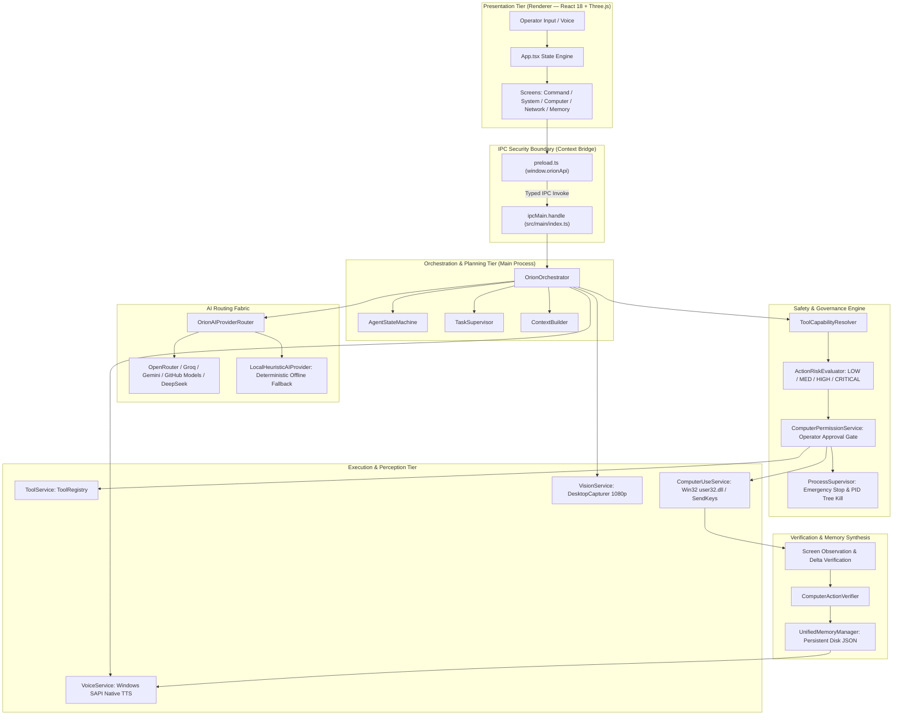
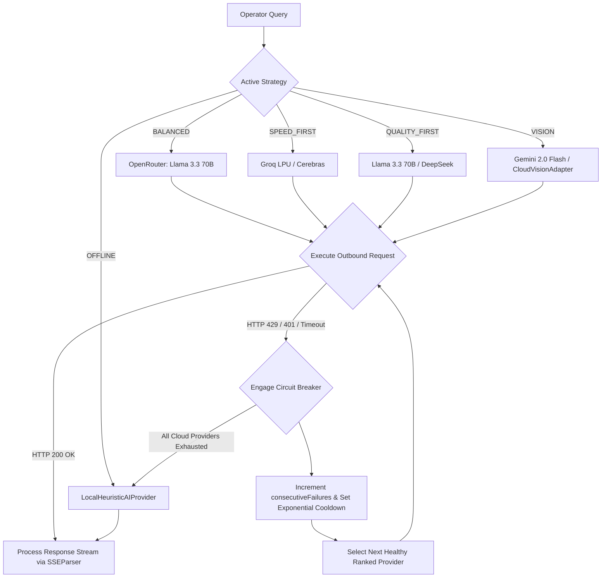
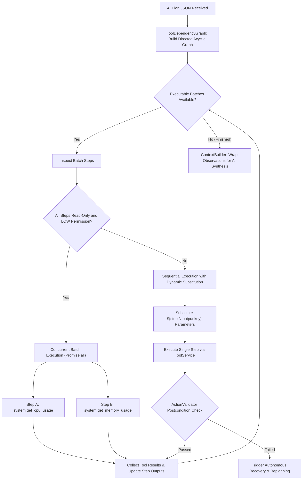
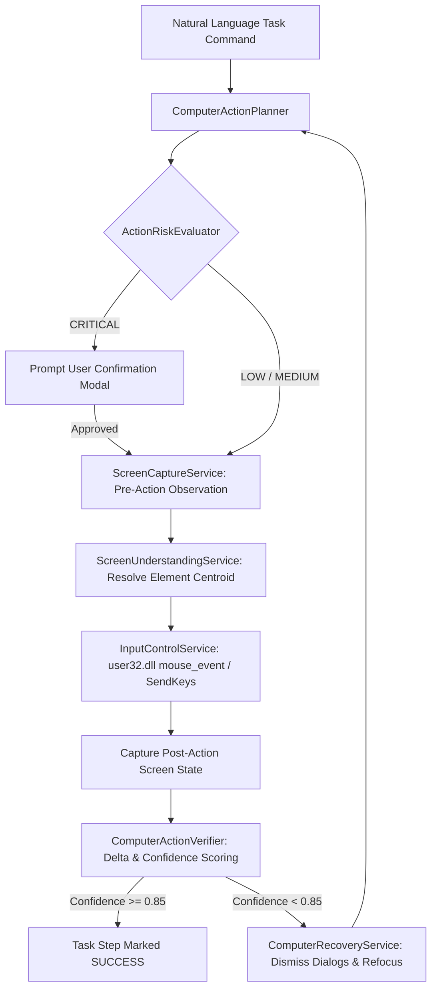
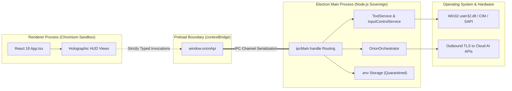

# ORION Architectural Diagrams & Visual Models

This directory contains the formal architectural diagrams for ORION. All diagrams are authored in standard GitHub Flavored Markdown Mermaid syntax for maintainability and version control tracking.

---

## Diagram 1: Complete System Overview

---

## Diagram 2: AI Provider Multi-Cloud Router & Circuit Breaker

---

## Diagram 3: DAG-Based Tool Execution Engine

---

## Diagram 4: Computer-Use Closed-Loop Pipeline

---

## Diagram 5: Electron Multi-Tier Process & Security Boundary

