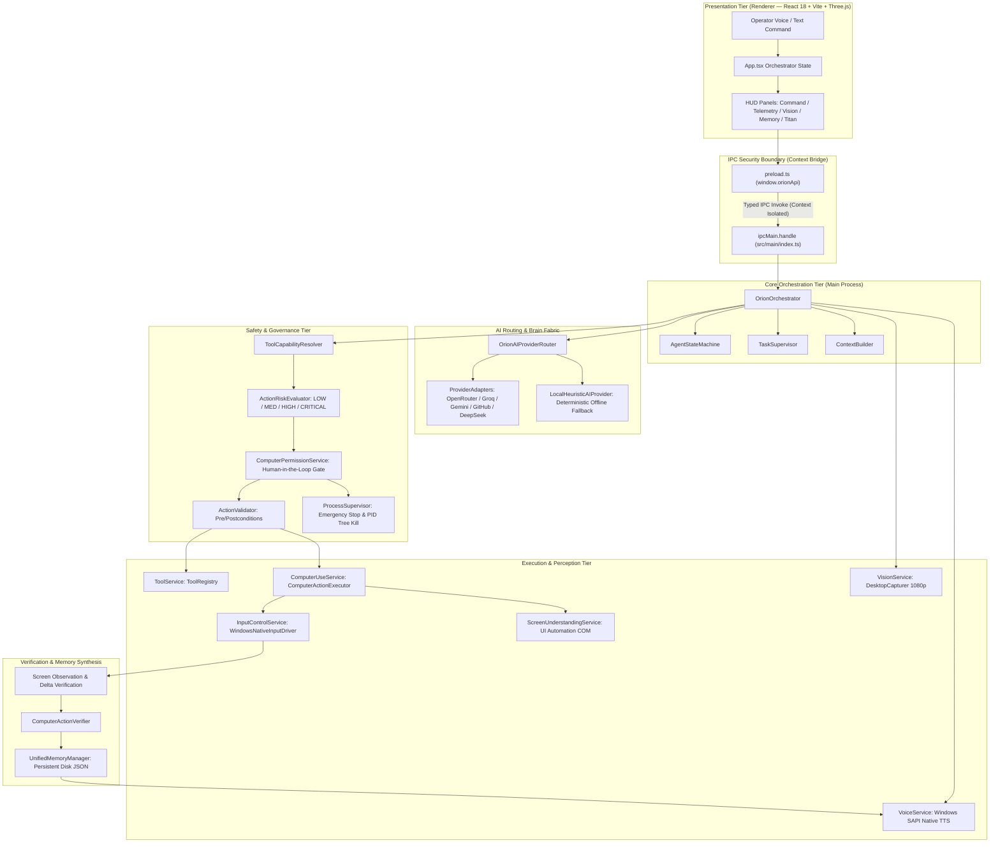
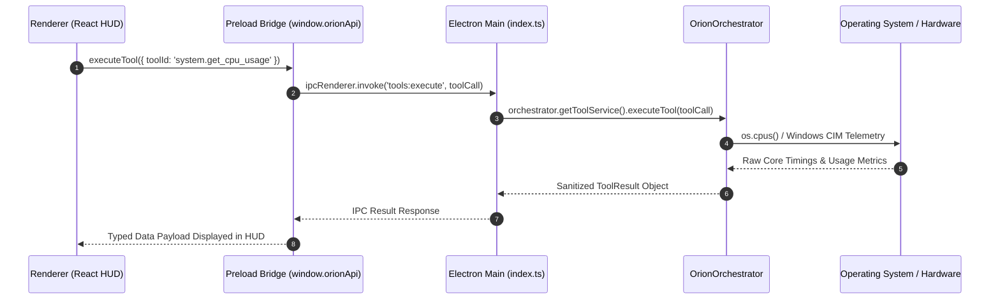
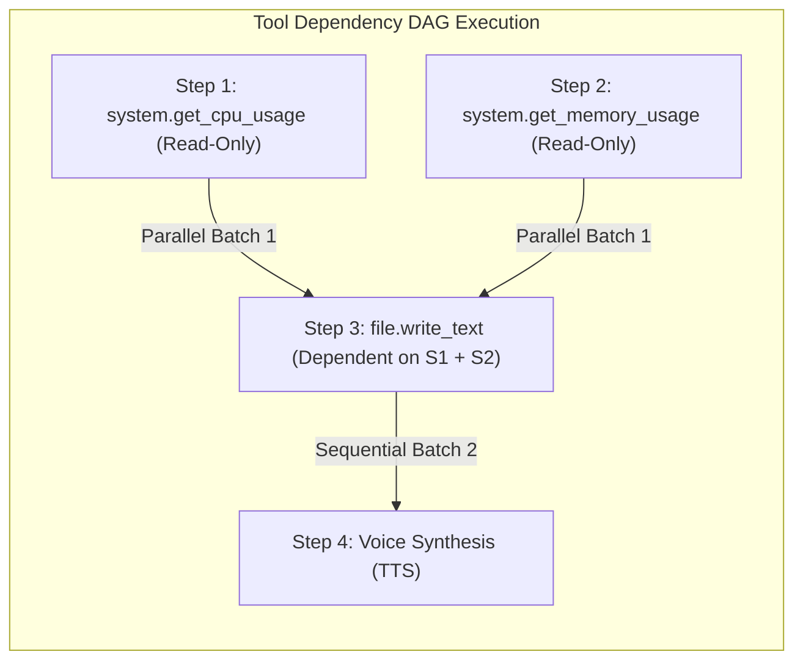
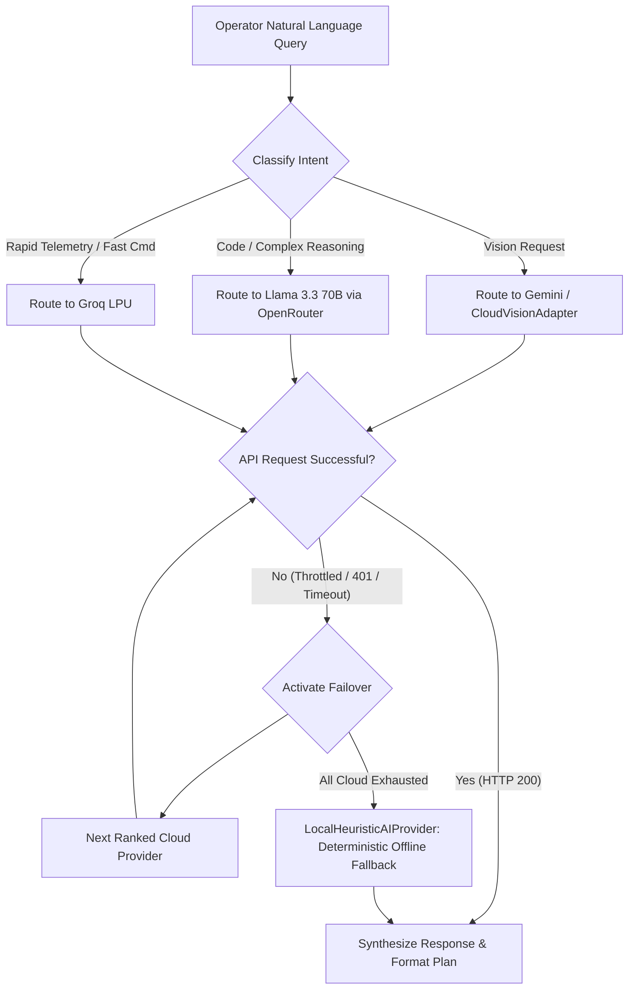
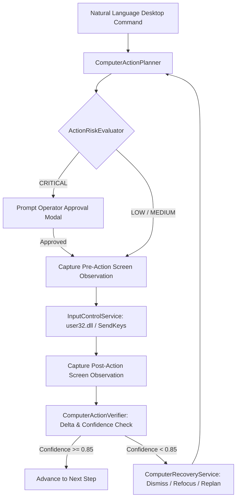

# ORION System Architecture Specification

**Product:** ORION (Autonomous Permission-Based AI Computer-Use Agent)  
**Author:** iMpact Engineering  
**Version:** 1.0.0 Architecture Specification  
**Classification:** Electron Multi-Tier Desktop Platform  

---

## 1. Architectural Philosophy

ORION is engineered around five fundamental commitments:

1. **Useful Before Impressive**: Prioritize concrete OS interactions, reliable system telemetry, and deterministic tool execution over speculative agentic behavior.
2. **The Operator Stays in Command**: Autonomous actions require explicit permission boundaries, structured audit trails, and an immediate hardware/process Emergency Stop.
3. **Restraint is a Feature**: Keep runtime boundaries strict. Cloud API keys remain quarantined in the Main process; the Renderer never receives secrets.
4. **Resilient Multimodal Routing**: If a cloud model throttles or fails, ORION immediately degrades to secondary cloud providers or local deterministic fallback routines without crashing.
5. **Observed Truth Over Assumptions**: The agent never assumes an action succeeded simply because a Win32 event was emitted; post-action states are verified via closed-loop observation.

---

## 2. High-Level Architecture Overview

ORION employs a segregated multi-tier architecture separating the **Presentation Tier** (Electron Renderer), the **Security & IPC Boundary** (Preload Script & Context Bridge), the **Orchestration & Planning Tier** (Electron Main Process), the **Perception & Safety Tier**, and the **System Execution Layer**.

---

## 3. Subsystem Breakdown

### 3.1. Electron Process Model & IPC Isolation

Security in desktop agent systems requires an impermeable boundary between untrusted UI rendering code and privileged OS execution.

* **Renderer Isolation**: The React application runs in a sandboxed Chromium renderer with `nodeIntegration: false` and `contextIsolation: true`.
* **Context Bridge**: Communication with the OS occurs exclusively through `window.orionApi`, exposed via Electron's `contextBridge` in `src/main/preload.ts`.
* **Main Process Sovereign Authority**: All API keys, environment credentials (`.env`), file system operations, and process spawns reside entirely in the Node.js Main process (`src/main/index.ts`). No sensitive tokens are ever sent to the renderer.

---

### 3.2. Core Orchestration Engine

Located in `src/main/services/OrionOrchestrator.ts`, the orchestrator coordinates multimodal user queries, intent classification, DAG tool parallelization, response synthesis, and audio feedback.

1. **State Machine (`AgentStateMachine.ts`)**: Enforces explicit transitions between defined states: `STANDBY` → `THINKING` → `PLANNING` → `EXECUTING` → `RESPONDING` → `SPEAKING`.
2. **Task Supervisor (`TaskSupervisor.ts`)**: Manages background task priorities (`LOW`, `MEDIUM`, `HIGH`, `CRITICAL`), deadline timeouts, progress tracking, and retry budgets.
3. **Dependency Graph Execution (`ExecutionContext.ts`)**: When an AI model emits a multi-step plan, `ToolDependencyGraph` analyzes dependencies:
   * **Parallel Execution**: Steps with independent inputs and `LOW` read-only permissions execute concurrently via `Promise.all()`.
   * **Sequential Execution**: Steps modifying system state or depending on earlier step outputs (`${step.N.output.key}`) execute sequentially.
   * **Replanning on Failure**: If a step fails, the orchestrator halts execution, records the failure, and triggers an autonomous replanning pass.

---

### 3.3. AI Brain Fabric & Provider Routing

Located in `src/main/services/OrionAIProviderRouter.ts` and `ProviderAdapters.ts`, ORION features an omnichannel multi-provider AI gateway.

* **Model Registry**: Central catalog mapping provider IDs, context lengths, token pricing tiers, and capabilities (`supportsTools`, `supportsVision`, `supportsStreaming`).
* **Active Providers**:
  1. `openrouter` (Meta Llama 3.3 70B Instruct — Sovereign Primary Engine)
  2. `groq` (GPT OSS 120B / Llama 3.3 70B — Ultra-Low Latency LPU)
  3. `gemini` (Gemini 2.0 Flash — Multimodal Vision & 1M Token Context)
  4. `github-models` (GPT-4o Mini / Llama 3.3 70B)
  5. `cerebras` (Llama 3.1 8B — Wafer-Scale Fast Inference)
  6. `mistral` (Mistral Small Latest)
  7. `nvidia` (NVIDIA NIM Catalog)
  8. `deepseek` (DeepSeek V3 / R1)
  9. `cloudflare` (Cloudflare Workers AI Llama Models)
  10. `offline-rule-router` (Deterministic Regex Fallback Engine)
* **Routing Strategies**:
  * `SPEED_FIRST`: Prioritizes Groq and Cerebras for sub-second response times.
  * `BALANCED`: Standard operational routing using OpenRouter and Gemini.
  * `QUALITY_FIRST`: Directs complex coding and multi-step reasoning to 70B+ models.
  * `VISION`: Automatically routes screen analysis requests to vision-enabled multimodal endpoints.
  * `OFFLINE`: Enforces zero network egress; executes entirely on local deterministic rule sets.

---

### 3.4. Computer-Use & Desktop Control Subsystem

Located in `src/main/services/computer/`, this subsystem gives ORION the ability to understand and interact with the Windows desktop environment safely.

* **Perception (`ScreenCaptureService.ts` & `ScreenUnderstandingService.ts`)**:
  * Captures 1080p desktop frames using Electron `desktopCapturer`.
  * Inspects Windows UI Automation element hierarchies via COM interfaces to resolve button labels, bounding boxes, and active focus windows.
* **Planning (`ComputerActionPlanner.ts`)**:
  * Translates natural language instructions into atomic `ComputerAction` structures (`mouse_move`, `click`, `type`, `hotkey`, `drag`, `scroll`).
  * Enforces credential redaction to prevent passwords or sensitive tokens from appearing in plans.
* **Execution (`ComputerActionExecutor.ts` & `InputControlService.ts`)**:
  * Dispatches synthetic input using native Win32 `user32.dll` (`mouse_event`) and `Wscript.Shell` (`SendKeys`).
  * Implements `activePlanLock` to prevent concurrent colliding automation routines.
* **Closed-Loop Verification (`ComputerActionVerifier.ts`)**:
  * Captures pre- and post-action screen states to calculate action confidence scores and verify expected state transitions before proceeding.
* **Recovery Engine (`ComputerRecoveryService.ts`)**:
  * Detects execution stalls, dismissing blocking dialogs via Escape key injections, refocusing lost application windows, and bounding recovery retries to 3 attempts.

---

### 3.5. Safety, Governance & Emergency Stop

ORION treats safety as an architectural constraint, not an afterthought:

* **Action Risk Evaluator (`ActionRiskEvaluator.ts`)**:
  * Evaluates commands against protected system paths (`C:\Windows`, `C:\Windows\System32`, `AppData\Local\Elevated`).
  * Assigns deterministic risk levels: `READ_ONLY`, `LOW_RISK`, `MODERATE_RISK`, `HIGH_RISK`, `CRITICAL`.
* **Process Supervisor (`ProcessSupervisor.ts`)**:
  * Maintains an active registry of all spawned child processes and abort controllers.
  * When **Emergency Stop** is triggered (via UI button, IPC, or keyboard interrupt), the supervisor terminates all active process trees via PID hierarchy kill commands (`taskkill /T /F /PID`).
  * Once in `ESTOPPED` state, any attempt to spawn new processes is immediately rejected.

---

### 3.6. Memory Architecture

ORION features a persistent multi-tier memory system:

* **Conversation Memory (`ConversationMemoryService.ts`)**: In-memory sliding window maintaining the immediate conversational turn context.
* **Explicit Memory (`MemoryService.ts`)**: Key-value memory entries stored with disk persistence at `.orion_memory/explicit_memory.json`.
* **Unified Semantic Memory (`UnifiedMemoryManager.ts`)**: Multi-tier semantic memory persisted to disk at `.orion_memory/unified_memory.json` with trust levels and tag indexing.
* **Reboot Persistence**: Both memory stores read from disk on startup and write atomically on mutation, ensuring context survives application restarts.

---

### 3.7. Audio & Speech Subsystem

Located in `src/main/services/VoiceService.ts`:

* **System Native TTS (`SystemTTSProvider`)**: Dispatches audio synthesis through Windows SAPI (`System.Speech.Synthesis.SpeechSynthesizer`) executed via isolated PowerShell bridge.
* **Instant Cancellation**: Calling `stopSpeaking()` immediately terminates the active speech process, allowing the operator to interrupt the assistant mid-sentence.
* **Speech-to-Text Interface (`ISpeechToTextProvider`)**: Clean abstraction designed for future on-device Whisper model binding.
