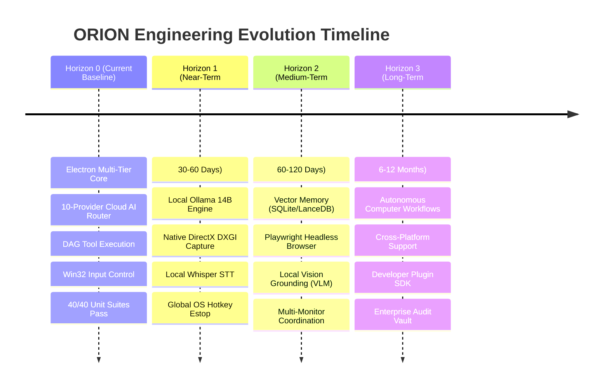

# ORION Strategic Product & Engineering Roadmap

**Product:** ORION  
**Company:** iMpact  
**Scope:** 12-Month Autonomous Desktop Agent Evolution  
**Guiding Principle:** Functionality Before Claims · Stability Before Scale  

---

## 1. Product Vision

The long-term mission of ORION is to become an indispensable, **permission-bound AI computer-use operating partner**. 

Rather than a chatbot confined to a web tab, ORION operates directly on the computer: understanding visual and UI context, planning tasks, manipulating tools, inspecting files, executing developer workflows, and automating repetitive digital work — always under the explicit command and safety boundaries of the human operator.

---

## 2. The Four Horizons

---

## 3. Detailed Horizon Specifications

### Horizon 0: Current Production Baseline (v1.0.0 Verified)
* **Core Architecture**: Segregated Electron Main/Renderer with typed IPC boundary (`window.orionApi`).
* **AI Fabric**: Omnichannel router with OpenRouter, Groq, Gemini, DeepSeek, and deterministic offline rule fallback.
* **Computer-Use**: Win32 native mouse/keyboard drivers (`user32.dll`, `Wscript.Shell`), UI Automation COM element tree inspection, and credential redaction.
* **Safety**: Dual-layer risk scoring (`ActionRiskEvaluator`), protected system path assertions, and process tree Emergency Stop (`ProcessSupervisor`).
* **Verification**: 40/40 test suites passing green in pure process isolation; clean TypeScript and Vite production builds.

---

### Horizon 1: Local Neural Inference & Hardware Grounding (30–60 Days)
* **Local Neural Inference**:
  * Integrate `LocalOllamaAdapter` targeting local `qwen2.5:14b-instruct` or `llama3.1:8b-instruct`.
  * Enable 100% private, zero-cost, offline neural reasoning utilizing the workstation's RTX A5500 (16 GB VRAM).
* **High-Speed Screen Capture (DXGI)**:
  * Replace Electron `desktopCapturer` (~100ms) with a native DirectX Desktop Duplication API (DXGI) bridge.
  * Reduce optical acquisition latency to **< 16ms** (60 FPS real-time capture).
* **On-Device Speech Recognition (STT)**:
  * Replace unconfigured STT interface with local Whisper.cpp or Whisper-ONNX running on GPU.
  * Enable fluid voice command input without cloud speech latency or privacy exposure.
* **Global Hardware Estop Hotkey**:
  * Implement an OS-level global keyboard hook (`Ctrl+Alt+Escape`) to trigger Emergency Stop even when the Electron window is minimized or out of focus.

---

### Horizon 2: Advanced Grounding & Persistent Context (60–120 Days)
* **Embedded Vector Memory**:
  * Upgrade `.orion_memory/` JSON files to an embedded SQLite database with vector indexing (`sqlite-vec` or `LanceDB`).
  * Enable semantic retrieval over weeks of historical operator preferences, project conventions, and past workflow traces.
* **Headless Chromium Automation Engine**:
  * Upgrade `BrowserProvider.ts` from raw HTTP fetching to an embedded Playwright engine.
  * Enable reliable interaction with complex single-page web applications (React, Angular, Canvas apps).
* **Local Vision Grounding (On-Device VLM)**:
  * Deploy quantized `Moondream2` (1.8B) or `Qwen2-VL-7B` on the local RTX A5500 GPU.
  * Eliminate cloud vision latency; achieve sub-300ms visual grounding of on-screen buttons, icons, and text.
* **Multi-Monitor Display Awareness**:
  * Enumerate and track multiple monitor geometries, DPI scaling factors, and display boundaries.

---

### Horizon 3: Autonomous Workflow Partner (6–12 Months)
* **Complex Multi-Step Workflow Engine**:
  * Execute 20+ step autonomous developer tasks (e.g. clone repo → install dependencies → fix test failure → compile build → generate report) with automated checkpointing and recovery.
* **Safe Extension & Tool SDK**:
  * Expose an open API allowing developers to author custom ORION tools in TypeScript or Python with declarative permission schemas.
* **Enterprise Compliance Audit Vault**:
  * Cryptographically sign all execution traces and tool logs, providing immutable proof of actions for security-conscious enterprise environments.
* **Cross-Platform OS Support**:
  * Abstract Win32-specific input and window providers to support macOS (Accessibility APIs) and Linux (X11 / Wayland).

---

## 4. Prioritization Matrix

Every planned feature is evaluated against our strict engineering rubric:

$$\text{Priority Score} = \frac{\text{Reliability Impact} \times 3 + \text{Operator Value} \times 2 + \text{Learning Depth}}{\text{Implementation Effort} \times \text{Safety Risk}}$$

Features with high safety risks or speculative reliability are deliberately postponed until foundational grounding layers are proven.

---

## 5. The Anti-Roadmap (What We Will NOT Build)

To maintain focus and engineering credibility, ORION explicitly rejects:

1. **Unconstrained Autonomous Self-Modification**: ORION will never have permission to modify its own core binary or bypass permission gates.
2. **Hidden Telemetry or Data Harvesting**: Zero analytics, zero usage tracking, zero silent cloud telemetry.
3. **Gimmicky Anthropomorphic Personas**: No simulated emotions, fake consciousness claims, or deceptive conversational personas. ORION is a precision tool.
4. **Cloud-Dependent Lock-In**: Features must always have a functional local or offline path.
