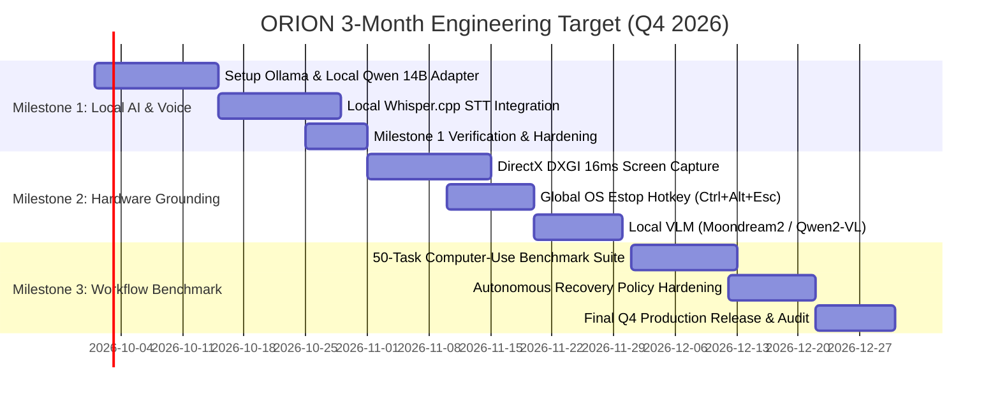

# ORION 3-Month Engineering Target & Milestone Plan

**Project:** ORION Execution Target  
**Author:** iMpact Engineering  
**Target Window:** October 1, 2026 – December 31, 2026  
**Primary Objective:** Transform the verified modular prototype into an ultra-reliable, locally accelerated, end-to-end computer-use agent.

---

## Executive Summary

The past development cycle established a clean multi-tier architecture: 40/40 test suites passing, robust multi-provider cloud routing, Win32 input automation, and a defense-in-depth safety engine.

The next three months focus strictly on **execution quality, local hardware acceleration, and workflow reliability**. At the end of this sprint, ORION will execute 50 diverse computer-use tasks locally on the RTX A5500 workstation with **> 90% autonomous success**, zero cloud dependencies, and sub-second input response times.

---

## Milestone 1: Local Neural Acceleration & Fluid Voice (Month 1: October)

### Objective
Eliminate cloud dependency for daily tasks by binding the workstation's NVIDIA RTX A5500 GPU (16 GB VRAM) directly into the ORION cognitive loop, and adding real local voice recognition.

### Key Tasks:
1. **Local Neural Router (`LocalOllamaAdapter.ts`)**:
   * Install and configure Ollama backend on `http://127.0.0.1:11434`.
   * Load `qwen2.5:14b-instruct-q4_K_M` (8.9 GB VRAM allocation).
   * Implement streaming tool-calling parser conforming strictly to `IAIProvider`.
2. **On-Device Speech Recognition (`LocalWhisperProvider.ts`)**:
   * Integrate `whisper.cpp` or `onnxruntime-node` with the Whisper Base/Small English model.
   * Pipe microphone audio streams directly from Renderer to Main process.
3. **Voice Activity Detection (VAD)**:
   * Implement Silero VAD or energy-based audio thresholding to automatically trigger transcription on silence.

### Verification Tests:
* Execute `node test_local_brain.cjs` with disconnected internet: model must classify intent, formulate plan, and return tool result locally.
* Spoken command: *"Check memory usage"* must transcribe accurately and trigger `system.get_memory_usage` within 2 seconds.

### Definition of Done:
* ORION functions 100% offline with zero external API calls.
* TTFT on local 14B model is `< 600ms`.
* Voice transcription latency is `< 800ms`.

---

## Milestone 2: High-Speed Hardware Grounding & Optical Vision (Month 2: November)

### Objective
Reduce optical capture latency from ~100ms to `< 16ms` using native DirectX DXGI APIs, and implement on-device visual grounding.

### Key Tasks:
1. **DirectX DXGI Screen Capture Bridge**:
   * Author or integrate a native Windows Desktop Duplication API (DXGI) Node.js addon.
   * Provide 60 FPS zero-copy frame access directly in GPU memory.
2. **Global OS Emergency Stop Keyboard Hook**:
   * Register a low-level Windows keyboard hook (`WH_KEYBOARD_LL`) via user32.dll for `Ctrl + Alt + Escape`.
   * Trigger `ProcessSupervisor.triggerEstop()` instantly regardless of active foreground window.
3. **Local Visual Grounding Engine**:
   * Deploy local quantized `Moondream2` (1.8B) or `Qwen2-VL-7B` for coordinate resolution.
   * Benchmark against Windows UI Automation to achieve optimal hybrid grounding.

### Verification Tests:
* Measure frame capture latency over 1,000 frames: average must be `< 20ms`.
* Trigger `Ctrl+Alt+Escape` during active mouse drag: automation must halt immediately.

### Definition of Done:
* Screen capture latency reduced by >75%.
* Global emergency stop triggers reliably under all window focus states.

---

## Milestone 3: 50-Task Computer-Use Benchmark & Hardening (Month 3: December)

### Objective
Prove end-to-end autonomy by creating and running an automated benchmark suite of 50 diverse real-world computer tasks, achieving >90% completion reliability.

### Key Tasks:
1. **Benchmark Suite Authoring (`ComputerUseBenchmarkRunner.ts`)**:
   * 15 File & Data Tasks (e.g. organizing folders, converting CSV to JSON, extracting zip archives).
   * 15 Browser & Web Tasks (e.g. researching documentation, scraping tables, filling forms).
   * 10 Developer Tasks (e.g. inspecting git status, building TypeScript projects, finding lint errors).
   * 10 Desktop Application Tasks (e.g. launching Notepad, editing text, switching between windows).
2. **Dynamic Replanning & Recovery Hardening**:
   * Feed post-action visual delta confidence scores directly into recovery triggers.
   * Implement automated window refocusing and dialog dismissal.
3. **Packaging & Release**:
   * Package verified v1.1.0 production build with signed executables and checksum manifests.

### Verification Tests:
* Run full 50-task automated benchmark battery. Record pass/fail rate, execution time, and recovery attempts.

### Definition of Done:
* Benchmark pass rate **>= 90% (45 / 50 tasks passing cleanly)**.
* Average recovery cycle resolves within 2 retry attempts.
* Final technical verification report published with complete benchmark traces.
