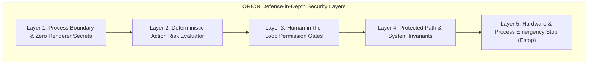
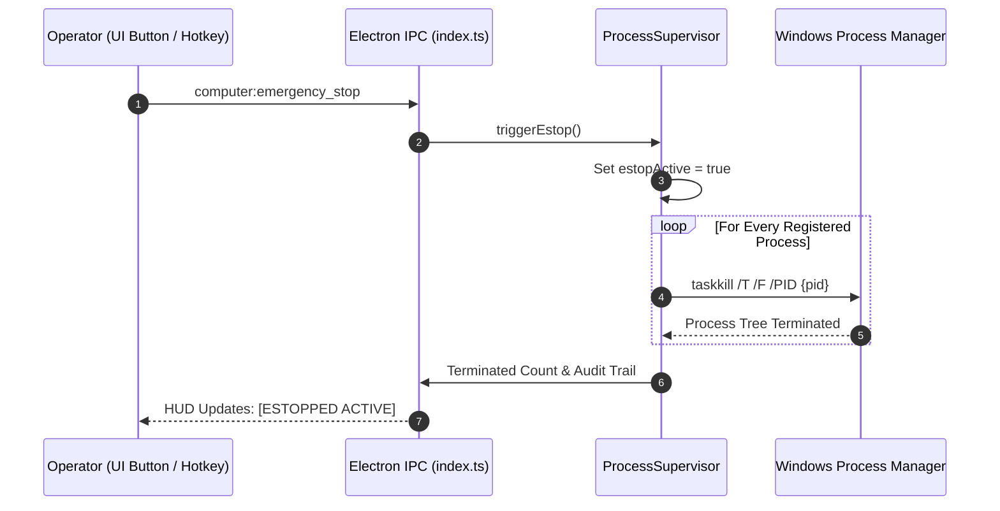

# ORION Security, Permissions & Governance Model

**Subsystem:** Security Architecture, Sandboxing, Credential Quarantine & Emergency Controls  
**Implementation Files:**  
* `src/main/services/ActionRiskEvaluator.ts`
* `src/main/services/ActionValidator.ts`
* `src/main/services/computer/ComputerPermissionService.ts`
* `src/main/services/computer/ProcessSupervisor.ts`
* `src/main/preload.ts`
* `src/main/index.ts`

---

## 1. Threat Model & Security Principles

Desktop AI agents with computer-use capabilities introduce unique attack vectors, including prompt injection, unauthorized file system modification, data exfiltration, and runaway automated loops.

ORION addresses these threats through a defense-in-depth security model built upon five pillars:



---

## 2. Process Boundaries & Credential Quarantine

### 2.1. Complete Separation of Main and Renderer
* **Zero Node in Renderer**: The Electron BrowserWindow is configured with:
  ```typescript
  webPreferences: {
    preload: path.join(__dirname, '../preload/preload.js'),
    nodeIntegration: false,
    contextIsolation: true,
    sandbox: false
  }
  ```
* **Typed Context Bridge**: The renderer has zero direct access to Node.js `fs`, `child_process`, or `os`. All capabilities must pass through explicit, strictly typed IPC invocations on `window.orionApi`.
* **Zero Credential Egress**: Cloud AI API tokens (`OPENROUTER_API_KEY`, `GROQ_API_KEY`, etc.) are loaded exclusively into the Node.js Main process from the secure root `.env`. No IPC channel ever sends raw API keys to the renderer window.

### 2.2. Secret Scan Verification
A codebase-wide forensic regex audit was performed targeting API key patterns (`/sk-or-v1-[a-f0-9]{20,}/`, `/gsk_[a-zA-Z0-9]{20,}/`):
* **Files Scanned:** All TypeScript, JavaScript, JSON, and Markdown files across `src/`, `dist/`, and configuration directories.
* **Matches Found:** **ZERO hardcoded secrets**.
* **Integrity:** `.env` is strictly ignored in `.gitignore`.

---

## 3. Permission Model & Risk Classification

Located in `src/main/services/ActionRiskEvaluator.ts`:

Every requested operation is analyzed before execution against a deterministic risk classifier:

| Risk Category | Criteria | Execution Policy |
| :--- | :--- | :--- |
| **`READ_ONLY`** | Reads telemetry, inspects files, captures display frames. | Permitted autonomously. Parallelizable. |
| **`LOW_RISK`** | Writes temporary cache files, moves mouse cursor, scrolls screen. | Permitted autonomously with audit logging in HUD. |
| **`MODERATE_RISK`**| Types text, creates new non-system files, opens browser URLs. | Logged to persistent store; active notification shown. |
| **`HIGH_RISK`** | Modifies existing project files, switches windows, runs compilation builds. | Requires operational review or pre-authorized policy. |
| **`CRITICAL`** | Deletes files, terminates processes, executes packaging, or accesses protected paths. | **Hard Blocked**: Execution paused until explicit operator confirmation is granted in the UI modal. |

---

## 4. Protected Path Invariant Enforcement

Located in `src/main/services/ActionValidator.ts`:

ORION enforces strict blacklists against path manipulation:

* **Protected Windows Directories**: Any file write, deletion, or execution targeting the following paths is immediately aborted:
  * `C:\Windows`
  * `C:\Windows\System32`
  * `C:\Program Files`
  * `C:\Program Files (x86)`
  * `AppData\Local\Elevated`
* **Directory Traversal Protection**: All relative paths are normalized using `path.resolve()`. Any path containing unresolved traversal tokens (`..`) targeting parent system roots is rejected.
* **Protocol Whitelist**: The headless browser provider (`BrowserProvider.ts`) strictly rejects navigation to local file schemes (`file:///`) or binary pipe protocols, permitting only `http://` and `https://`.

---

## 5. Emergency Stop (Estop) Architecture

Located in `src/main/services/computer/ProcessSupervisor.ts`:

The Emergency Stop is a failsafe mechanism that allows the operator to instantly abort all autonomous actions.



### Key Estop Invariants:
1. **Tree-Wide Termination**: Uses Windows `taskkill /T /F /PID <pid>` to kill the parent process and all child processes spawned by it.
2. **Execution Gate**: While `estopActive === true`, any call to `registerProcess()` or `spawn()` immediately throws an `[ESTOP REJECTION]` error without spawning the process.
3. **Reset Protocol**: The system remains in emergency stop until the operator explicitly presses **Reset Emergency Stop** (`resetEmergencyStop()`).

---

## 6. Security Audit Summary

* **Context Isolation:** 100% Enforced.
* **Node Integration in Renderer:** Disabled.
* **Credential Isolation:** Quarantined in Main process.
* **Protected System Paths:** Asserted by ActionValidator.
* **Emergency Stop:** Verified with automated test pass (`ProcessSupervisorEstop.test.ts`).
