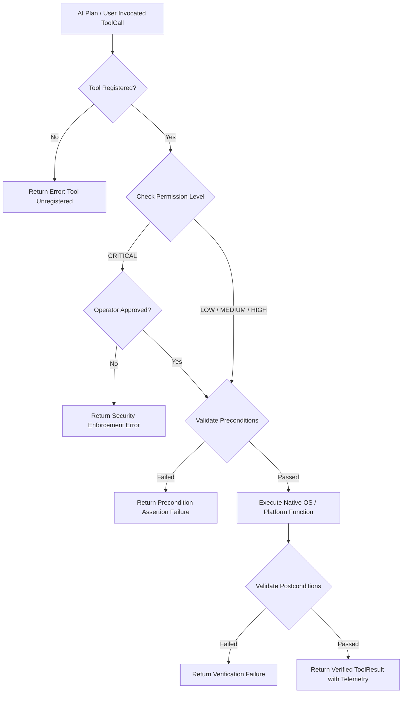

# ORION Tool Execution & Grounding Engine

**Subsystem:** Tool Registry, Execution Service & Sandboxed System Actions  
**Implementation Files:**  
* `src/main/services/ToolRegistry.ts`
* `src/main/services/ToolService.ts`
* `src/main/services/ActionValidator.ts`
* `src/main/services/ToolCapabilityResolver.ts`
* `src/main/services/titan/TitanToolProvider.ts`

---

## 1. Overview & Architecture

In ORION, tools are the bridge between AI cognitive planning and real-world operating system action. The tool system is designed around strict deterministic boundaries:

1. **Explicit Schemas**: Every tool defines an immutable ID, descriptive name, categorization, permission level, read-only flag, and strict parameter schemas.
2. **Deterministic Risk Gating**: The agent cannot bypass permission checks. Tools marked with elevated risk require programmatic or operator verification.
3. **Execution Sandboxing & Sanitization**: File paths, shell commands, and URL arguments are sanitized before reaching OS APIs.
4. **Execution Telemetry**: Every tool invocation records an exact start time, duration in milliseconds (`executionTimeMs`), verification status, and structured error diagnostics.

---

## 2. Permission Levels & Governance

ORION classifies tools into four security tiers:

| Permission Level | Description | Execution Policy | Example Tools |
| :--- | :--- | :--- | :--- |
| **`LOW`** | Pure read-only system inspection with zero state modification. | Automated execution permitted without prompt. Parallelizable. | `system.get_info`, `system.get_cpu_usage`, `file.read_text`, `browser.navigate` |
| **`MEDIUM`** | Non-destructive local modifications or simulated user input. | Permitted with audit logging; user notification displayed in HUD. | `file.write_text`, `computer.execute_action`, `browser.search` |
| **`HIGH`** | Operations modifying application focus, active tasks, or external network requests. | Requires operational review; logged to persistent audit store. | `computer.natural_language_command`, `titan.render_draft` |
| **`CRITICAL`** | Destructive file modifications, process termination, or release deployments. | **Strictly blocked** unless explicit human confirmation is received. | `file.delete`, `process.kill`, `titan.package_release` |

---

## 3. Tool Catalog & Specification Directory

### 3.1. System Telemetry & Diagnostics Tools (`system.*`)

* **`system.get_info`**
  * **Permission:** `LOW` | **Read-Only:** Yes
  * **Description:** Returns host hardware model, operating system, platform, architecture, uptime, and CPU model.
  * **Implementation:** Node.js native `os` module (`os.hostname()`, `os.platform()`, `os.uptime()`).

* **`system.get_cpu_usage`**
  * **Permission:** `LOW` | **Read-Only:** Yes
  * **Description:** Computes live per-core utilization breakdown across all 24 logical processor threads.
  * **Implementation:** Samples `os.cpus()` times comparing active cycles against idle cycles.

* **`system.get_memory_usage`**
  * **Permission:** `LOW` | **Read-Only:** Yes
  * **Description:** Reports total system RAM, active memory consumption, and free capacity.
  * **Implementation:** Reads `os.totalmem()` and `os.freemem()`, converting to formatted gigabyte values.

* **`system.get_disk_usage`**
  * **Permission:** `LOW` | **Read-Only:** Yes
  * **Description:** Retrieves primary drive volume labels, total storage, free storage, and percentage used.
  * **Implementation:** Queries Windows `Win32_LogicalDisk` via PowerShell CIM commands.

* **`system.get_network_status`**
  * **Permission:** `LOW` | **Read-Only:** Yes
  * **Description:** Inspects local network adapters, active IPv4 addresses, and MAC addresses.
  * **Implementation:** Filters `os.networkInterfaces()` for non-internal active network adapters.

* **`system.get_current_time`**
  * **Permission:** `LOW` | **Read-Only:** Yes
  * **Description:** Returns system local time, UTC timestamp, and timezone.

---

### 3.2. File System Management Tools (`file.*`)

* **`file.list_directory`**
  * **Permission:** `LOW` | **Read-Only:** Yes
  * **Parameters:** `dirPath` (string, optional - defaults to current working directory)
  * **Implementation:** `fs.readdirSync()` with file type statistics (`isDirectory`, size, modification timestamp).

* **`file.read_text`**
  * **Permission:** `LOW` | **Read-Only:** Yes
  * **Parameters:** `filePath` (string, required)
  * **Security Guards:** Path normalization prevents directory traversal attacks (`..`). Blocked if targeting protected Windows system paths.

* **`file.write_text`**
  * **Permission:** `MEDIUM` | **Read-Only:** No
  * **Parameters:** `filePath` (string, required), `content` (string, required)
  * **Implementation:** Writes UTF-8 text atomically to disk. Directories are created recursively if they do not exist.

---

### 3.3. Computer-Use & Desktop Control Tools (`computer.*`)

* **`computer.observe`**
  * **Permission:** `LOW` | **Read-Only:** Yes
  * **Description:** Captures high-resolution screen screenshot, active window title, UI Automation element bounding boxes, and cursor coordinates.

* **`computer.plan_task`**
  * **Permission:** `LOW` | **Read-Only:** Yes
  * **Parameters:** `command` (string, required)
  * **Description:** Decomposes a natural language command into structured atomic actions with risk evaluation.

* **`computer.execute_action`**
  * **Permission:** `MEDIUM` | **Read-Only:** No
  * **Parameters:** `action` (Structured `ComputerAction` object, required)
  * **Description:** Executes atomic mouse clicks, keystrokes, or window focus actions via `WindowsNativeInputDriver`.

* **`computer.natural_language_command`**
  * **Permission:** `MEDIUM` | **Read-Only:** No
  * **Parameters:** `command` (string, required)
  * **Description:** Executes a complete closed-loop Observe-Plan-Act-Verify desktop control sequence.

---

### 3.4. Web Browser Tools (`browser.*`)

* **`browser.navigate`**
  * **Permission:** `LOW` | **Read-Only:** Yes
  * **Parameters:** `url` (string, required)
  * **Security Boundary:** Strictly enforces `http://` and `https://` schemes. Blocks `file://` or local socket navigation.
  * **Implementation:** Native HTTP fetch engine parsing page HTML, extracting clean text, page title, and clickable anchors.

* **`browser.search`**
  * **Permission:** `LOW` | **Read-Only:** Yes
  * **Parameters:** `query` (string, required)
  * **Description:** Performs web search query and extracts result titles and URLs.

---

### 3.5. Titan Video Production Tools (`titan.*`)

Registered via `TitanToolProvider.ts`, these specialized domain tools power autonomous video asset processing:

* **`titan.inspect_draft`**: Verifies dynamic video targets in `Project_Titan/07_Video_Projects/Experimental/`.
* **`titan.render_draft`**: Dispatches render automation for specified targets.
* **`titan.qa_retention`**: Evaluates visual cut density, hook timing, and pacing metrics against quality thresholds.
* **`titan.package_release`**: Packages verified video builds into distribution directories (`08_Distribution/Releases`).
* **`titan.validate_release`**: Generates cryptographic checksums and verifies package integrity.

---

## 4. Precondition & Postcondition Validation (`ActionValidator.ts`)

To ensure reliability, state transitions are verified before and after tool execution:

* **Precondition Check**:
  * For file reads: asserts file exists on disk.
  * For window actions: asserts target application process is active.
  * For mouse actions: asserts coordinates are within current screen boundaries.
* **Postcondition Verification**:
  * For file writes: verifies file was created and file size is greater than 0 bytes.
  * For window switching: verifies active foreground window title matches target.
  * For web navigation: verifies HTTP status code was 200.

If a postcondition check fails, the tool result is marked `verificationStatus: 'FAILED'`, notifying the orchestrator to trigger recovery replanning.
