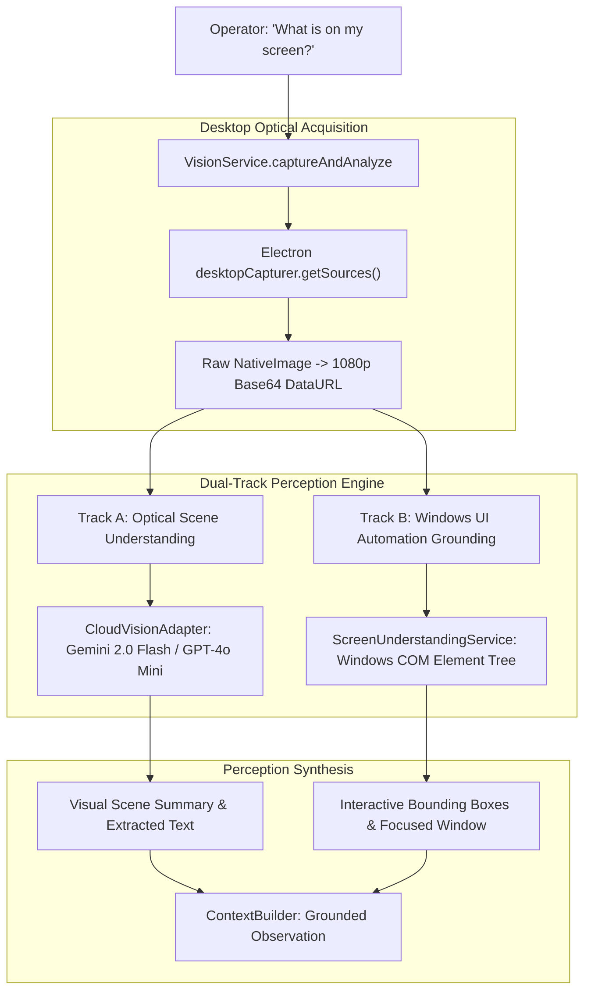

# ORION Visual Context & Perception Architecture

**Subsystem:** Screen Capture, Multimodal Vision & Optical Grounding  
**Implementation Files:**  
* `src/main/services/VisionService.ts`
* `src/main/services/computer/ScreenCaptureService.ts`
* `src/main/services/computer/ScreenUnderstandingService.ts`
* `src/renderer/screens/VisionScreen.tsx`

---

## 1. Vision System Architecture

Visual perception allows ORION to ground user commands in the active desktop context. Instead of relying solely on blind accessibility trees, ORION combines optical image capture with semantic UI Automation inspection:



---

## 2. Desktop Screenshot Acquisition Pipeline

Located in `src/main/services/VisionService.ts` and `ScreenCaptureService.ts`:

1. **Source Discovery**: Invocates Electron's `desktopCapturer.getSources({ types: ['screen'], thumbnailSize: { width: 1920, height: 1080 } })`.
2. **Display Selection**: Queries primary display adapter. Defaults to screen source index 0.
3. **DataURL Encoding**: Converts `NativeImage` buffer to JPEG/PNG Base64 DataURL (`data:image/png;base64,...`).
4. **Event Emission**: Dispatches telemetry events `vision.capture.started` and `vision.captured` across the internal `eventBus`.

### Performance & Latency:
* **Measured Screen Acquisition Latency:** **85ms – 135ms** on Dell Precision RTX A5500.
* **Buffer Size:** ~1.2 MB – 2.8 MB depending on visual entropy.

---

## 3. Optical Scene Analysis (`CloudVisionAdapter`)

When multimodal credentials are configured, visual frames are dispatched to multimodal cloud models:

* **Gemini 2.0 Flash**: Preferred vision model due to high visual grounding accuracy and sub-2-second generation latency.
* **Prompt Structure**: Instructs the model to identify:
  1. Active foreground application and window title.
  2. Main visual content, layout, and document structure.
  3. Noticeable alerts, error modals, or interactive buttons.
  4. Extracted readable text snippets.

### Honest Fallback State:
If no cloud vision API key is configured, `DefaultVisionProvider` returns an honest diagnostic result rather than inventing content:
```json
{
  "timestamp": 1726924800000,
  "isMock": false,
  "analysis": {
    "source": "SCREENSHOT",
    "detectedObjects": [],
    "extractedText": "VISION NOT CONFIGURED",
    "sceneSummary": "ORION Vision Provider is currently NOT CONFIGURED for external screen analysis. Screen capture executed successfully."
  }
}
```

---

## 4. UI Element Tree Grounding (`ScreenUnderstandingService`)

For interactive computer-use tasks (clicking, typing), optical pixels alone can be ambiguous. ORION augments screen frames with Windows UI Automation:

* **Inspection Engine**: Dispatches an isolated PowerShell script accessing the Windows `UIAutomationClient` COM assembly.
* **Extracted Attributes**:
  * Element Name / Text Label
  * Control Type (Button, EditBox, Window, MenuItem, Tab)
  * Bounding Rectangle (`x`, `y`, `width`, `height`)
  * Enabled & Focused States
* **Grounding Resolution**: Maps natural language targets (e.g. *"Click the Save button"*) to exact pixel coordinates by computing the centroid of the matched bounding box:
  $$x_{\text{center}} = x + \frac{\text{width}}{2}, \quad y_{\text{center}} = y + \frac{\text{height}}{2}$$

---

## 5. Current Bottlenecks & Known Limitations

1. **Cloud Vision Latency**: Round-trip cloud multimodal calls require **1,800ms – 3,200ms**, which is too slow for real-time video feedback loops.
2. **UI Automation Traversal Overhead**: Deep UI element trees on complex applications (e.g., modern Chromium web pages) can take **900ms – 1,400ms** to dump via PowerShell COM.
3. **High-DPI Display Scaling**: Windows display scaling factors (e.g., 125% or 150%) require coordinate normalization to align logical desktop coordinates with physical screen pixels.

---

## 6. Target Vision Architecture (Next Milestone)

To transition ORION into an ultra-fast, fully local vision agent:

1. **DirectX Desktop Duplication API (DXGI)**: Replace Electron's `desktopCapturer` with native C++ DirectX frame grabbing, reducing capture time from 100ms to **< 16ms** (60 FPS real-time observation).
2. **Local Vision-Language Model (VLM)**: Deploy `Moondream2` (1.8B parameters) or `Qwen2-VL-7B` running directly on the NVIDIA RTX A5500 GPU. This will provide sub-300ms on-device screen interpretation without network transmission.
3. **Native C++ UIAutomation Hook**: Replace PowerShell COM invocation with a compiled native Node.js C++ addon to eliminate the process spawn overhead.
