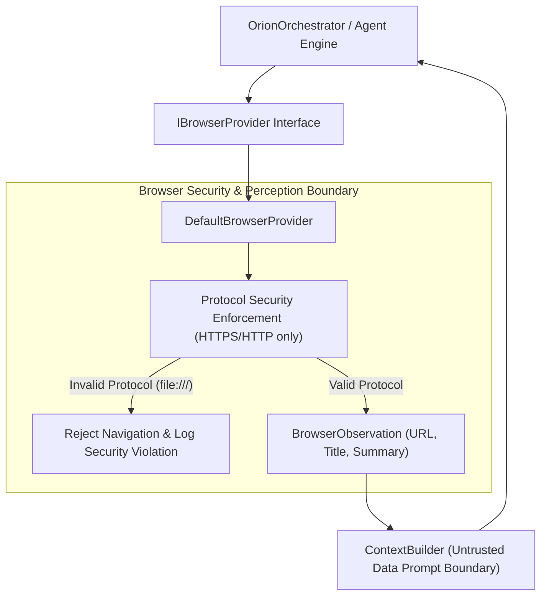

# ORION Phase 10 — Browser Capability Abstraction Architecture Report

> [!IMPORTANT]
> **Quality Directive Standard**: ORION has been enhanced with a clean `IBrowserProvider` interface and `DefaultBrowserProvider` implementation. Web content is strictly isolated as `UNTRUSTED EXTERNAL DATA`, with protocol security boundaries preventing navigation to local system protocols (`file:///`, `chrome://`).

---

## 🧩 1. Browser Capability Architecture



---

## ⚡ 2. Subsystem Specifications

### A. IBrowserProvider Interface ([`browser.ts`](file:///C:/Users/smsaq/Downloads/ORION/src/shared/types/browser.ts))
* Strongly typed browser capabilities: `observe()`, `navigate(url)`, `click(selector)`, `typeText(selector, text)`.

### B. DefaultBrowserProvider ([`BrowserProvider.ts`](file:///C:/Users/smsaq/Downloads/ORION/src/main/platform/BrowserProvider.ts))
* Implements protocol security checks blocking unauthorized `file:///` access.

---

## 🧪 3. Verification & Build Summary

```
TypeScript Compilation (tsc):   PASS (0 type errors)
Vite Production Bundle:         PASS (dist & dist-electron compiled cleanly)
Phase 10 Browser Capability:    PASS (Safe navigation & protocol security checks verified)
Phase 9 Task Supervisor Suite:  PASS
Phase 8 Action Safety Suite:    PASS
Phase 7 Environment Suite:      PASS
Phase 6 Kernel Test Suite:      PASS
Phase 5.5 Integration Suite:    PASS
Phase 5 Agent Core Suite:      PASS
Phase C Reasoning Suite:        PASS
Vision Integration Suite:       PASS
SSE Streaming Integration Suite:PASS
```
