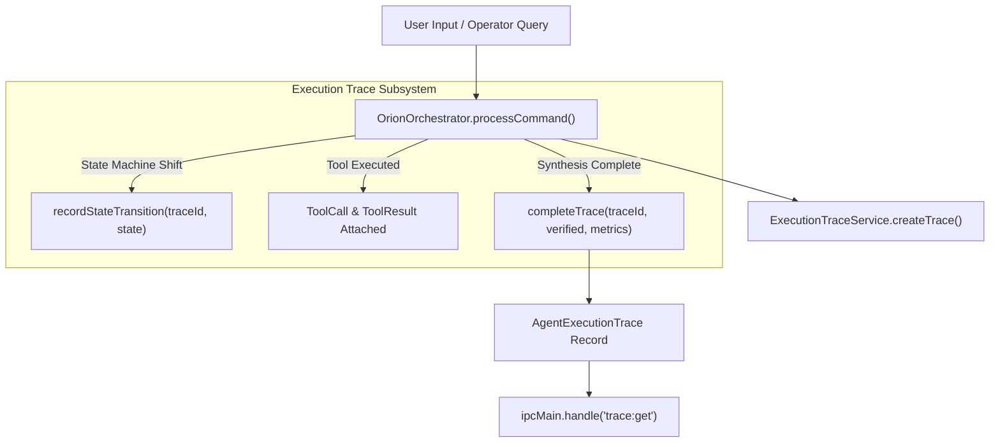

# ORION Phase 11 — Execution Traceability & Event Subsystem Architecture Report

> [!IMPORTANT]
> **Quality Directive Standard**: ORION has been enhanced with structured `AgentExecutionTrace` telemetry and `ExecutionTraceService` tracking every state transition, plan generated, tool call executed, observation recorded, and verification result.

---

## 🧩 1. Execution Trace Architecture



---

## ⚡ 2. Core Subsystem Specifications

### A. AgentExecutionTrace Contract ([`eventDriven.ts`](file:///C:/Users/smsaq/Downloads/ORION/src/shared/types/eventDriven.ts))
* Encapsulates complete lifecycle metadata: `traceId`, `timestamp`, `query`, `stateTransitions`, `plansGenerated`, `toolCallsExecuted`, `toolResults`, `observationsRecorded`, `telemetryMetrics`, `verificationSuccess`, `replanningCount`.

### B. ExecutionTraceService ([`ExecutionTraceService.ts`](file:///C:/Users/smsaq/Downloads/ORION/src/main/services/ExecutionTraceService.ts))
* Main process service recording traces and state shifts in real-time.

### C. Preload IPC Exposure ([`src/main/index.ts`](file:///C:/Users/smsaq/Downloads/ORION/src/main/index.ts#L188-L191))
* Safe `trace:get` IPC channel exposed via `window.orionApi.getTrace(traceId)`.

---

## 🧪 3. Verification & Build Summary

```
TypeScript Compilation (tsc):   PASS (0 type errors)
Vite Production Bundle:         PASS (dist & dist-electron compiled cleanly)
Phase 11 Execution Trace:       PASS (Trace creation, state transition recording, completion verified)
Phase 10 Browser Capability:    PASS
Phase 9 Task Supervisor Suite:  PASS
Phase 8 Action Safety Suite:    PASS
Phase 7 Environment Suite:      PASS
Phase 6 Kernel Test Suite:      PASS
Phase 5.5 Integration Suite:    PASS
Phase 5 Agent Core Suite:      PASS
Phase C Reasoning Suite:        PASS
Vision Integration Suite:       PASS
SSE Streaming Integration Suite:PASS
```
