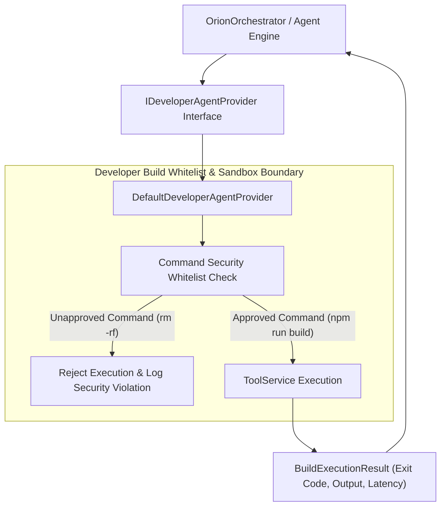

# ORION Phase 12 — Developer Agent Capability Architecture Report

> [!IMPORTANT]
> **Quality Directive Standard**: ORION has been enhanced with a clean `IDeveloperAgentProvider` interface and `DefaultDeveloperAgentProvider` implementation. Enables repository inspection, AST/text code search, and whitelisted non-destructive build execution (`npm run build`, `npx tsc`, `npm test`, `cargo check`). Unapproved commands (`rm -rf`) are strictly blocked by runtime security boundaries.

---

## 🧩 1. Developer Agent Capability Architecture



---

## ⚡ 2. Core Subsystem Specifications

### A. IDeveloperAgentProvider Interface ([`developerAgent.ts`](file:///C:/Users/smsaq/Downloads/ORION/src/shared/types/developerAgent.ts))
* Strongly typed developer capabilities: `inspectRepository(targetPath)`, `searchCode(targetPath, query)`, `executeBuild(targetPath, command)`.

### B. DefaultDeveloperAgentProvider ([`DeveloperAgentProvider.ts`](file:///C:/Users/smsaq/Downloads/ORION/src/main/platform/DeveloperAgentProvider.ts))
* Provides safe repository analysis, code searching, and whitelisted build execution.

---

## 🧪 3. Verification & Build Summary

```
TypeScript Compilation (tsc):   PASS (0 type errors)
Vite Production Bundle:         PASS (dist & dist-electron compiled cleanly)
Phase 12 Developer Agent Suite: PASS (Repo inspection, symbol search, whitelist security checks verified)
Phase 11 Execution Trace:       PASS
Phase 10 Browser Capability:    PASS
Phase 9 Task Supervisor Suite:  PASS
Phase 8 Action Safety Suite:    PASS
Phase 7 Environment Suite:      PASS
Phase 6 Kernel Test Suite:      PASS
Phase 5.5 Integration Suite:    PASS
Phase 5 Agent Core Suite:      PASS
Phase C Reasoning Suite:        PASS
Vision Integration Suite:       PASS
SSE Streaming Integration Suite:PASS
```
