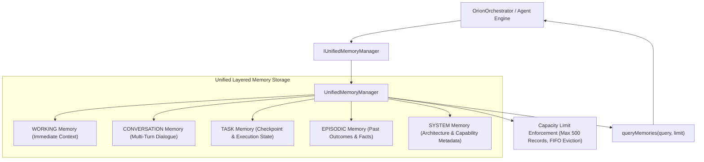

# ORION Phase 13 — Unified Layered Memory Architecture Report

> [!IMPORTANT]
> **Quality Directive Standard**: ORION has been enhanced with a bounded `IUnifiedMemoryManager` interface and `UnifiedMemoryManager` implementation supporting explicit memory layers (`WORKING`, `CONVERSATION`, `TASK`, `EPISODIC`, `SYSTEM`), tag querying, layer-specific clearing, and trust level annotations (`TRUSTED_SYSTEM`, `UNTRUSTED_EXTERNAL`).

---

## 🧩 1. Unified Layered Memory Architecture



---

## ⚡ 2. Core Subsystem Specifications

### A. MemoryRecord & MemoryLayerType ([`memoryManager.ts`](file:///C:/Users/smsaq/Downloads/ORION/src/shared/types/memoryManager.ts))
* Strongly typed memory records featuring `id`, `type` (`WORKING`, `CONVERSATION`, `TASK`, `EPISODIC`, `SYSTEM`), `content`, `tags`, and `trustLevel` (`TRUSTED_SYSTEM`, `UNTRUSTED_EXTERNAL`).

### B. UnifiedMemoryManager ([`UnifiedMemoryManager.ts`](file:///C:/Users/smsaq/Downloads/ORION/src/main/services/UnifiedMemoryManager.ts))
* Main process service managing multi-layer memory storage with bounded capacity limits preventing RAM memory inflation.

---

## 🧪 3. Verification & Build Summary

```
TypeScript Compilation (tsc):   PASS (0 type errors)
Vite Production Bundle:         PASS (dist & dist-electron compiled cleanly)
Phase 13 Unified Memory Suite:  PASS (Layered storage, tag querying, layer clearing verified)
Phase 12 Developer Agent Suite: PASS
Phase 11 Execution Trace:       PASS
Phase 10 Browser Capability:    PASS
Phase 9 Task Supervisor Suite:  PASS
Phase 8 Action Safety Suite:    PASS
Phase 7 Environment Suite:      PASS
Phase 6 Kernel Test Suite:      PASS
Phase 5.5 Integration Suite:    PASS
Phase 5 Agent Core Suite:      PASS
Phase C Reasoning Suite:        PASS
Vision Integration Suite:       PASS
SSE Streaming Integration Suite:PASS
```
