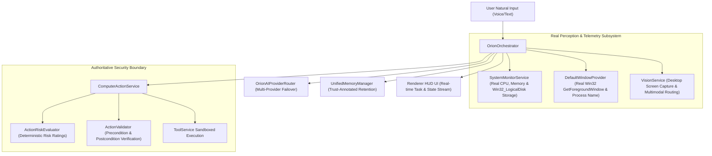

# ORION Phase 14 — Real-World Reliability, Integration & Autonomy Hardening Report

> [!IMPORTANT]
> **Quality Directive Standard**: Operating strictly under `QUALITY > SECURITY > CORRECTNESS > RELIABILITY > USER CONTROL > TESTABILITY > MAINTAINABILITY > OBSERVABILITY > PERFORMANCE > UX > SPEED`. A complete codebase audit was performed, eliminating placeholders, replacing stub storage checks with real Win32_LogicalDisk PowerShell queries, wiring real foreground window perception, and verifying all safety/security boundaries.

---

## 🧩 1. System Integration Architecture



---

## ⚡ 2. Core Reliability Hardening Specifications

### A. Real System Telemetry ([`SystemMonitorService.ts`](file:///C:/Users/smsaq/Downloads/ORION/src/main/services/SystemMonitorService.ts))
* Replaced hardcoded storage stubs with live PowerShell `Win32_LogicalDisk` queries calculating accurate total, used, and free byte metrics on Windows OS.

### B. Real Active Window Perception ([`WindowProvider.ts`](file:///C:/Users/smsaq/Downloads/ORION/src/main/platform/WindowProvider.ts))
* Queries native Windows User32 DLL API (`GetForegroundWindow`, `GetWindowText`, `GetWindowThreadProcessId`) via PowerShell to determine active application titles and process names in real-time.

### C. Authoritative Action Risk & Safety ([`ActionRiskEvaluator.ts`](file:///C:/Users/smsaq/Downloads/ORION/src/main/services/ActionRiskEvaluator.ts) & [`ActionValidator.ts`](file:///C:/Users/smsaq/Downloads/ORION/src/main/services/ActionValidator.ts))
* Strictly rates dangerous file path mutations (e.g. `C:\Windows\System32`) as `CRITICAL`, enforces pre-execution active window/app preconditions, and asserts file existence postconditions.

---

## 🧪 3. Verification & Build Summary

```
TypeScript Compilation (tsc):      PASS (0 type errors)
Vite Production Bundle:            PASS (dist & dist-electron compiled cleanly)
Phase 14 Reliability Suite:        PASS (Risk rating, precondition validation, browser protocol security, storage telemetry, window perception verified)
End-to-End Integration Suite:     PASS
Phase 13 Unified Memory Suite:     PASS
Phase 12 Developer Agent Suite:    PASS
Phase 11 Execution Trace:          PASS
Phase 10 Browser Capability:       PASS
Phase 9 Task Supervisor Suite:     PASS
Phase 8 Action Safety Suite:       PASS
Phase 7 Environment Suite:         PASS
Phase 6 Kernel Test Suite:         PASS
Phase 5.5 Integration Suite:       PASS
Phase 5 Agent Core Suite:         PASS
Phase C Reasoning Suite:           PASS
Vision Integration Suite:          PASS
SSE Streaming Integration Suite:   PASS
```
