# ORION Phase 5.5 — Full-System Integration, Adversarial Testing & Hardening Report

> [!IMPORTANT]
> **Quality Directive Standard**: All subsystem modules across Phase 1 (HUD), Phase 2 (Telemetry/Tools), Phase 3 (Vision/Voice), Phase 4 (Omni-Brain Router), Phase A (SSE Streaming), Phase B (Multimodal Vision), Phase C (DAG Execution/Memory), and Phase 5 (Agent State Machine/ToolRegistry) have been integrated and verified as one unified, hardened computer intelligence engine.

---

## 🔍 1. End-to-End Runtime Pipeline Integration

```mermaid
flowchart LR
    User["User Query / Voice"] --> IPC["Main/Preload IPC"]
    IPC --> Orchestrator["OrionOrchestrator"]
    Orchestrator --> StateMachine["AgentStateMachine (VALIDATED TRANSITION)"]
    StateMachine --> Memory["ConversationMemoryService"]
    Memory --> Router["OrionAIProviderRouter (Scored Provider Selection)"]
    Router --> DAG["ToolDependencyGraph (Prerequisite & Cycle Validation)"]
    DAG --> Exec["ToolService + ToolRegistry"]
    Exec --> Verification["Verification Engine (Assertion Check)"]
    Verification --> Security["Prompt-Injection Security Filter"]
    Security --> Synthesis["LLM Response Synthesis"]
    Synthesis --> Telemetry["CommandTelemetryMetrics"]
```



---

## 🛡️ 2. Security Red Team & Injection Defenses

1. **Prompt-Injection Defense Boundary ([`OrionOrchestrator.ts`](file:///C:/Users/smsaq/Downloads/ORION/src/main/services/OrionOrchestrator.ts#L273-L282))**:
   - Tool execution outputs fed back into LLM response synthesis are strictly wrapped in an explicit `SYSTEM INSTRUCTION` boundary marking all tool output data as `UNTRUSTED EXTERNAL DATA`.
   - Hostile instructions embedded in files, screenshots, or tool outputs are isolated and treated purely as raw content rather than executable prompt authority.

2. **IPC & Credential Safety**:
   - `ipcMain.handle` endpoints validate input parameter types.
   - Provider API keys and `.env` secrets remain strictly isolated within Electron Main process memory. Zero renderer exposure.

---

## 🧪 3. Final Integration Test Matrix & Build Verification

```
TypeScript Compilation (npx tsc):   PASS (0 type errors)
Vite & Electron Production Build:  PASS (dist/index.html & dist-electron compiled cleanly)
Phase 5.5 Integration Suite:        PASS (Fast-path, dynamic parameter substitution, prompt-injection defense verified)
Phase 5 Agent Core Suite:          PASS (State transitions, ToolRegistry, Verification Engine, Task Memory verified)
Phase C Reasoning Suite:            PASS (DAG cycle rejection, parallel execution verified)
Vision Integration Suite:           PASS (Multimodal frame capture & provider failover verified)
SSE Streaming Integration Suite:    PASS (ReadableStream consumption & 3-stage timeouts verified)
```

---

## 📄 4. Summary & Readiness

* **All 27 Final Acceptance Criteria Checklist Items**: **PASSED**
* **Known Critical Regressions**: **ZERO**
* **System Status**: **HARDENED & PRODUCTION-READY**
