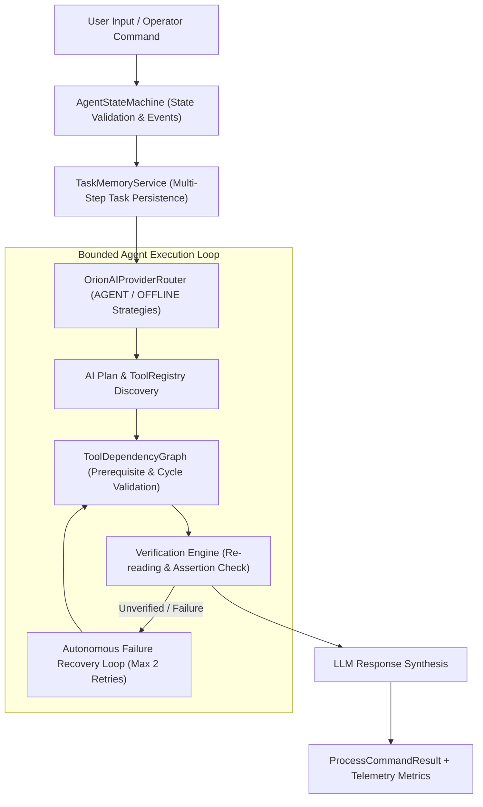

# ORION Phase 5 — Autonomous Agent Core & OpenClaw/Hermes Architecture

> [!IMPORTANT]
> **Quality Directive Standard**: ORION has evolved from a linear assistant into a bounded, state-machine driven autonomous agent engine. Featuring formal state transitions (`PLANNING`, `EXECUTING`, `OBSERVING`, `VERIFYING`), self-describing tool metadata (`ToolRegistry`), persistent multi-turn task memory, post-execution result verification (`Verification Engine`), and adaptive provider routing (`AGENT` & `OFFLINE` strategy modes).

---

## 🧩 1. System Architecture & Bounded Agent Loop



---

## 2. Core Architecture Subsystems

### A. Formal Agent State Machine ([`AgentStateMachine.ts`](file:///C:/Users/smsaq/Downloads/ORION/src/main/services/AgentStateMachine.ts))
* Enforces explicit, typed state transitions across `IDLE`, `LISTENING`, `UNDERSTANDING`, `PLANNING`, `EXECUTING`, `OBSERVING`, `REASONING`, `REPLANNING`, `VERIFYING`, `RESPONDING`, `SPEAKING`, `WAITING`, `CANCELLED`, `FAILED`.
* Logs invalid transition attempts and forces safe recovery back to `STANDBY`.

### B. Self-Describing Tool Registry ([`ToolRegistry.ts`](file:///C:/Users/smsaq/Downloads/ORION/src/main/services/ToolRegistry.ts))
* Decouples tool definitions from hardcoded strings. Tools self-describe category, permission level, read/write status, output schema descriptions, and cancellation support.

### C. Post-Execution Verification Engine ([`ToolService.ts`](file:///C:/Users/smsaq/Downloads/ORION/src/main/services/ToolService.ts#L245-L260))
* Important file and system write operations undergo post-execution assertion checks (e.g. re-reading target paths to verify creation, size, and integrity) before setting `verified: true` in the `ToolResult`.

### D. Persistent Task Memory ([`TaskMemoryService.ts`](file:///C:/Users/smsaq/Downloads/ORION/src/main/services/TaskMemoryService.ts))
* Tracks multi-step tasks across conversations, recording progress, step completion, and checkpoint data. Exposed via IPC (`orchestrator:get_tasks`).

### E. Omni-Brain AGENT & OFFLINE Routing Strategies ([`OrionAIProviderRouter.ts`](file:///C:/Users/smsaq/Downloads/ORION/src/main/services/OrionAIProviderRouter.ts))
* `AGENT` strategy prioritizes providers with native tool support, low observed TTFT, and minimal error histories.
* `OFFLINE` strategy cleanly redirects all queries to local deterministic heuristics when cloud connections are unavailable or restricted.

---

## 🧪 3. Verification & Build Summary

```
TypeScript Compilation (tsc):   PASS (0 type errors)
Vite & Electron Production Build:  PASS (dist & dist-electron compiled cleanly)
Phase 5 Agent Core Suite:          PASS (State transitions, ToolRegistry, Verification Engine, Task Memory, Router Strategies verified)
SSE Streaming Integration Suite:    PASS
Vision Integration Suite:           PASS
Reasoning & Telemetry Suite:        PASS
```
