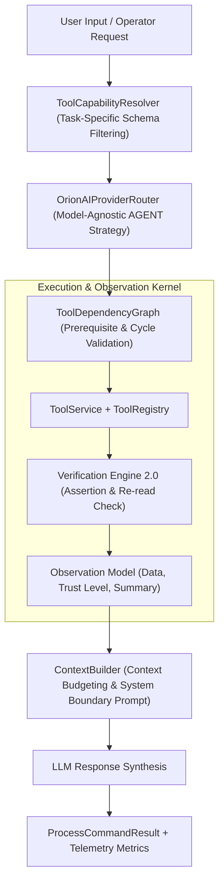

# ORION Phase 6 — Autonomous Agent Intelligence Architecture Report

> [!IMPORTANT]
> **Quality Directive Standard**: ORION has been upgraded into a modular, production-grade agent intelligence runtime featuring intelligent context budgeting (`ContextBuilder`), task-specific schema filtering (`ToolCapabilityResolver`), structured observation data objects (`Observation`), and formal Verification Engine 2.0 assertion statuses (`VERIFIED`, `EXECUTED`, `PARTIALLY_VERIFIED`, `FAILED`).

---

## 🧩 1. Phase 6 Agent Intelligence Pipeline



---

## ⚡ 2. Subsystem Specifications

### A. ContextBuilder ([`ContextBuilder.ts`](file:///C:/Users/smsaq/Downloads/ORION/src/main/services/ContextBuilder.ts))
* Enforces strict context character budgets (48,000 max total chars, 12,000 max observation chars).
* Encloses untrusted tool outputs inside clear system authority security prompt boundaries.

### B. ToolCapabilityResolver ([`ToolCapabilityResolver.ts`](file:///C:/Users/smsaq/Downloads/ORION/src/main/services/ToolCapabilityResolver.ts))
* Resolves task-specific tool categories based on request semantics, preventing injection of unnecessary schemas into prompt context.

### C. Observation Model & Verification 2.0 ([`src/shared/types/index.ts`](file:///C:/Users/smsaq/Downloads/ORION/src/shared/types/index.ts#L110-L125))
* Encapsulates output in typed `Observation` structures (`executionId`, `toolCallId`, `trustLevel`, `verificationStatus`).
* Standardizes verification outcomes (`VERIFIED`, `EXECUTED`, `PARTIALLY_VERIFIED`, `FAILED`, `UNKNOWN`).

---

## 🧪 3. Verification & Build Summary

```
TypeScript Compilation (tsc):   PASS (0 type errors)
Vite Production Bundle:         PASS (dist & dist-electron compiled cleanly)
Phase 6 Kernel Test Suite:      PASS (ContextBuilder, ToolCapabilityResolver, Verification 2.0 verified)
Phase 5.5 Integration Suite:    PASS
Phase 5 Agent Core Suite:      PASS
Phase C Reasoning Suite:        PASS
Vision Integration Suite:       PASS
SSE Streaming Integration Suite:PASS
```
