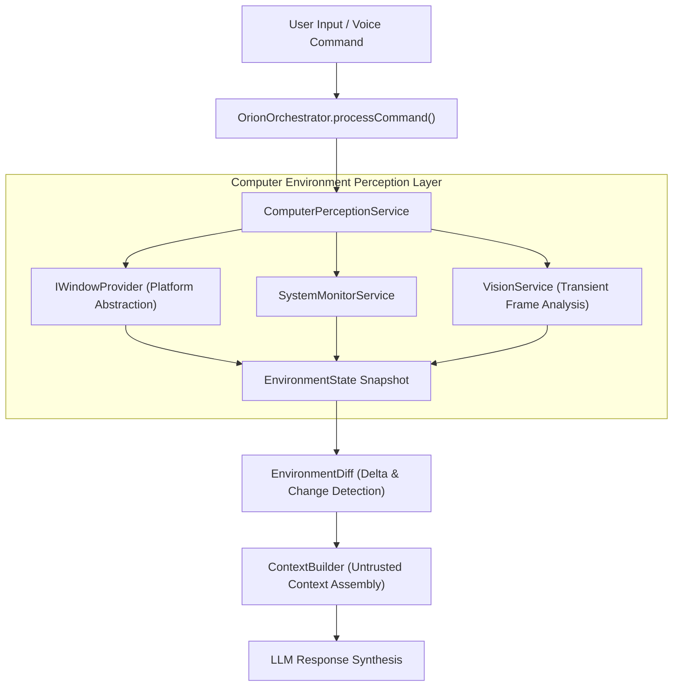

# ORION Phase 7 — Computer Control & Environment Intelligence Architecture Report

> [!IMPORTANT]
> **Quality Directive Standard**: ORION has been extended with a platform-agnostic Computer Environment Perception Layer. Featuring a strongly-typed `EnvironmentState` model, platform-isolated `IWindowProvider` abstraction, real-time `EnvironmentDiff` delta detection, and `ComputerPerceptionService` integration inside `OrionOrchestrator`.

---

## 🧩 1. Phase 7 Computer Perception Pipeline



---

## ⚡ 2. Core Architecture Subsystems

### A. EnvironmentState & EnvironmentDiff ([`environment.ts`](file:///C:/Users/smsaq/Downloads/ORION/src/shared/types/environment.ts))
* `EnvironmentState`: Strongly typed representation of active application process name, active window title and bounds, visible windows, display counts, system hardware telemetry, and active agent task state.
* `EnvironmentDiff`: Computes precise deltas between successive snapshots to determine if active apps, active windows, or system hardware utilization shifted significantly.

### B. Platform WindowProvider Abstraction ([`WindowProvider.ts`](file:///C:/Users/smsaq/Downloads/ORION/src/main/platform/WindowProvider.ts))
* Platform-agnostic `IWindowProvider` interface isolating platform-specific window enumeration logic. `DefaultWindowProvider` provides safe Electron Main fallback.

### C. ComputerPerceptionService ([`ComputerPerceptionService.ts`](file:///C:/Users/smsaq/Downloads/ORION/src/main/services/ComputerPerceptionService.ts))
* Normalizes window enumeration, hardware monitor snapshots, and transient vision analyses into timestamped `EnvironmentState` snapshots.

---

## 🧪 3. Verification & Build Summary

```
TypeScript Compilation (tsc):   PASS (0 type errors)
Vite Production Bundle:         PASS (dist & dist-electron compiled cleanly)
Phase 7 Environment Suite:      PASS (EnvironmentState snapshot, WindowProvider, EnvironmentDiff verified)
Phase 6 Kernel Test Suite:      PASS
Phase 5.5 Integration Suite:    PASS
Phase 5 Agent Core Suite:      PASS
Phase C Reasoning Suite:        PASS
Vision Integration Suite:       PASS
SSE Streaming Integration Suite:PASS
```
