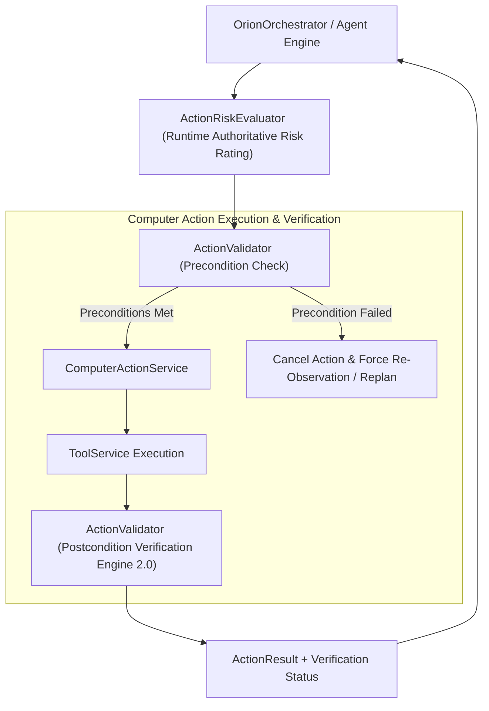

# ORION Phase 8 — Computer Action Framework & Action Safety Architecture Report

> [!IMPORTANT]
> **Quality Directive Standard**: ORION has been enhanced with a strongly-typed `ComputerAction` framework, runtime-authoritative `ActionRiskEvaluator`, Precondition and Postcondition assertion engine (`ActionValidator`), and `ComputerActionService` execution sandboxing.

---

## 🧩 1. Action Safety & Verification Pipeline



---

## 2. Core Architecture Subsystems

### A. ComputerAction & Risk Levels ([`action.ts`](file:///C:/Users/smsaq/Downloads/ORION/src/shared/types/action.ts))
* `ComputerAction`: Strongly typed action structure with risk classifications (`READ_ONLY`, `LOW_RISK`, `MODERATE_RISK`, `HIGH_RISK`, `CRITICAL`).
* Preconditions (`expectedActiveApp`, `expectedActiveWindow`, `requiredFilePath`) & Postconditions (`verifyFileExists`, `verifyMinFileSize`).

### B. ActionRiskEvaluator ([`ActionRiskEvaluator.ts`](file:///C:/Users/smsaq/Downloads/ORION/src/main/services/ActionRiskEvaluator.ts))
* Enforces runtime authoritative risk ratings (e.g. system path write operations are elevated to `CRITICAL`), preventing natural-language LLMs from self-granting permission.

### C. ActionValidator ([`ActionValidator.ts`](file:///C:/Users/smsaq/Downloads/ORION/src/main/services/ActionValidator.ts))
* **Preconditions**: Asserts active application, window title, or path existence before action execution. If environment changed, execution is safely aborted.
* **Postconditions**: Asserts state mutation (file creation, size minimums) before returning `postconditionsVerified: true`.

---

## 🧪 3. Verification & Build Summary

```
TypeScript Compilation (tsc):   PASS (0 type errors)
Vite Production Bundle:         PASS (dist & dist-electron compiled cleanly)
Phase 8 Action Safety Suite:    PASS (Risk ratings, Precondition aborts, Postconditions verified)
Phase 7 Environment Suite:      PASS
Phase 6 Kernel Test Suite:      PASS
Phase 5.5 Integration Suite:    PASS
Phase 5 Agent Core Suite:      PASS
Phase C Reasoning Suite:        PASS
Vision Integration Suite:       PASS
SSE Streaming Integration Suite:PASS
```
