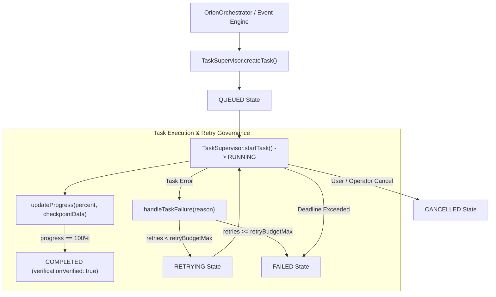

# ORION Phase 9 — Background Task Supervisor Architecture Report

> [!IMPORTANT]
> **Quality Directive Standard**: ORION has been enhanced with a robust `TaskSupervisor` background task management subsystem supporting typed state lifecycles (`QUEUED`, `RUNNING`, `PAUSED`, `WAITING`, `RETRYING`, `BLOCKED`, `COMPLETED`, `FAILED`, `CANCELLED`), deadline checking, checkpoint progress tracking, and retry budget bounds.

---

## 🧩 1. Background Task Supervisor Pipeline



---

## ⚡ 2. Core Subsystem Specifications

### A. BackgroundTaskRecord Data Contract ([`taskSupervisor.ts`](file:///C:/Users/smsaq/Downloads/ORION/src/shared/types/taskSupervisor.ts))
* Enforces explicit lifecycle metadata: `taskId`, `executionId`, `title`, `description`, `status`, `priority` (`LOW`, `MEDIUM`, `HIGH`, `CRITICAL`), `deadlineMs`, `retryBudgetMax`, `retriesAttempted`, `checkpointData`, `progressPercent`, `verificationVerified`.

### B. TaskSupervisor ([`TaskSupervisor.ts`](file:///C:/Users/smsaq/Downloads/ORION/src/main/services/TaskSupervisor.ts))
* Provides thread-safe task management in Main process memory, emitting activity events across `eventBus`.
* Automated deadline checking via `checkDeadlines()`.

### C. IPC Exposure ([`src/main/index.ts`](file:///C:/Users/smsaq/Downloads/ORION/src/main/index.ts#L185-L188))
* Exposed safely through preload context bridge (`window.orionApi.getSupervisorTasks()`).

---

## 🧪 3. Verification & Build Summary

```
TypeScript Compilation (tsc):   PASS (0 type errors)
Vite Production Bundle:         PASS (dist & dist-electron compiled cleanly)
Phase 9 Task Supervisor Suite:  PASS (QUEUED/RUNNING/COMPLETED lifecycle, retry budget, cancellation verified)
Phase 8 Action Safety Suite:    PASS
Phase 7 Environment Suite:      PASS
Phase 6 Kernel Test Suite:      PASS
Phase 5.5 Integration Suite:    PASS
Phase 5 Agent Core Suite:      PASS
Phase C Reasoning Suite:        PASS
Vision Integration Suite:       PASS
SSE Streaming Integration Suite:PASS
```
