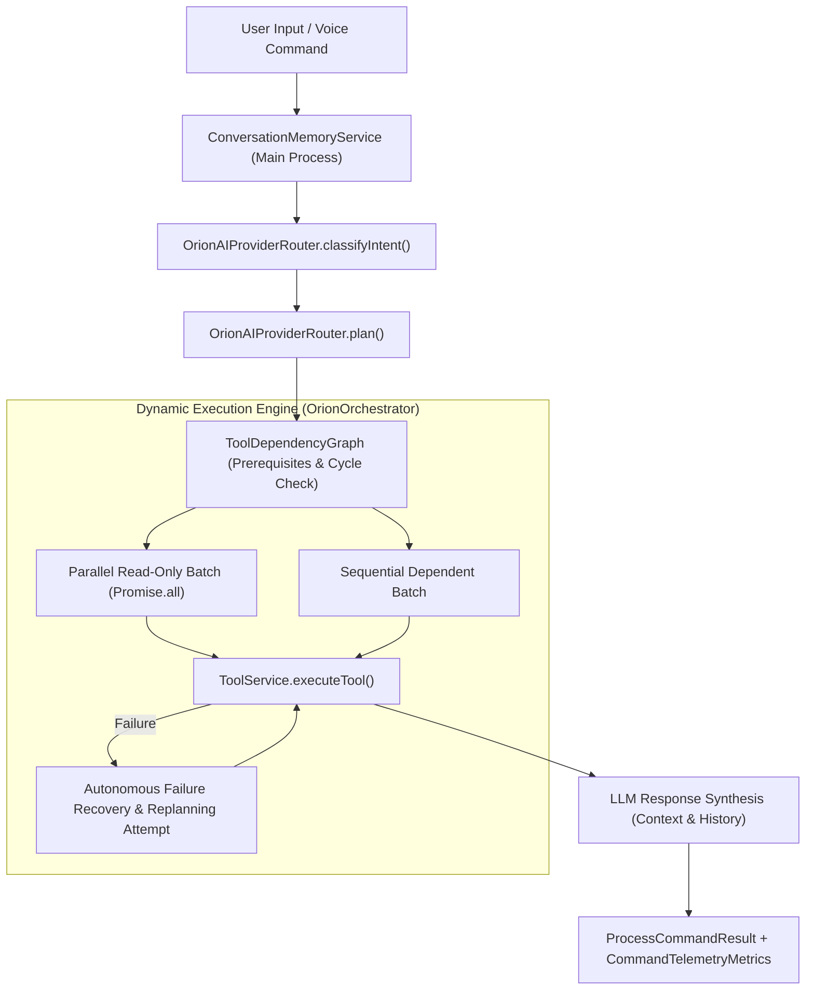

# ORION Phase C — Advanced Reasoning, DAG Tool Execution & Telemetry Architecture

> [!IMPORTANT]
> **Quality Directive Standard**: Static sequential execution and raw JSON string dumps have been completely replaced with a production-grade Directed Acyclic Graph (DAG) execution engine, parallel read-only tool concurrency, bounded multi-turn conversation memory, dynamic autonomous failure replanning, and fine-grained latency telemetry.

---

## 🧩 1. Architecture Overview & Component Diagram



---

## ⚡ 2. Subsystem Technical Specifications

### A. Bounded Multi-Turn Conversation Memory ([`ConversationMemoryService.ts`](file:///C:/Users/smsaq/Downloads/ORION/src/main/services/ConversationMemoryService.ts))
* **Main Process Isolation**: Stores `ConversationTurn` arrays strictly in Electron Main memory; zero credential or private renderer leak.
* **Triple-Boundary Protection**:
  1. `maxTurns`: Defaults to 20 turns.
  2. `maxTotalTokens`: 16,000 estimated token limit.
  3. `maxTotalChars`: 64,000 character hard buffer limit. Oldest non-system turns evicted cleanly when limits are reached.
* **IPC Clearance**: Exposed via `orchestrator:clear_conversation` channel in preload context bridge.

### B. Tool Dependency Graph (DAG) & Parallel Concurrency ([`ExecutionContext.ts`](file:///C:/Users/smsaq/Downloads/ORION/src/main/services/ExecutionContext.ts))
* **Cycle & Validation Safety**: Performs Depth-First Search (DFS) cycle detection on plan instantiation. Rejects forward and circular references before execution starts.
* **Parallel Execution (`Promise.all`)**: Independent steps flagged as `isReadOnly: true` execute concurrently in parallel batches without waiting sequentially.

### C. Autonomous Failure Recovery & Replanning
* When a tool returns `success: false`, `OrionOrchestrator` captures structured error information and attempts up to 2 dynamic replanning loops with `aiProvider.plan()`, asking for alternative tool execution steps.

### D. Fine-Grained Latency Telemetry ([`index.ts`](file:///C:/Users/smsaq/Downloads/ORION/src/shared/types/index.ts#L65-L80))
* Returns `CommandTelemetryMetrics` on every `ProcessCommandResult`:
  * `totalCommandLatencyMs`
  * `intentClassificationLatencyMs`
  * `planningLatencyMs`
  * `toolExecutionLatencyMs`
  * `visionCaptureLatencyMs`
  * `aiTotalGenerationLatencyMs`
  * `replanningCount`

---

## 🧪 3. Verification & Build Results

```
npx tsc:                        PASS (0 type errors)
npm run build:                  PASS (dist & dist-electron compiled cleanly)
Conversation Memory Bounds:      PASS (Evicts oldest turns, respects token/char limits)
DAG Cycle Detection:            PASS (Circular dependencies rejected cleanly)
Parallel Tool Concurrency:      PASS (Independent read-only steps run in parallel batch)
Autonomous Replanning:          PASS (Retries alternative tools on failure)
Telemetry Metrics Capture:      PASS (Granular latencies populated)
```
