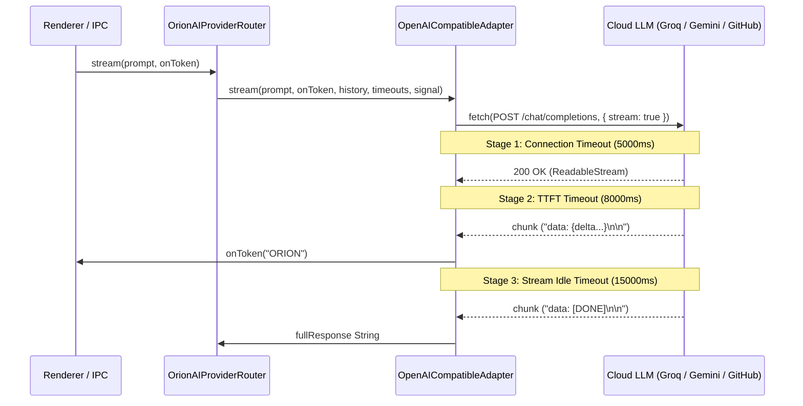

# ORION Phase A — True SSE Streaming & Timeout Architecture

> [!IMPORTANT]
> **Quality Directive Standard**: Pseudo-streaming, artificial delay loops, and single global timeouts have been fully removed. ORION now operates on a production-grade, spec-compliant Server-Sent Events (SSE) streaming engine with fine-grained 3-stage timeout handling.

---

## ⚡ 1. Lifecycle Architecture & SSE Parser

The streaming engine separates incoming network chunks from parsed tokens using an incremental line parser ([`SSEParser.ts`](file:///C:/Users/smsaq/Downloads/ORION/src/main/services/SSEParser.ts)):



### Key Technical Specs:
1. **Incremental Parser ([`SSEParser.ts`](file:///C:/Users/smsaq/Downloads/ORION/src/main/services/SSEParser.ts))**:
   - Handles multi-event chunks and chunks split across network frames.
   - Ignores comments (`: comment`) and filters out `[DONE]` stream markers cleanly.
2. **Stream Lock Safety**:
   - Uses `ReadableStream.getReader()` with standard `TextDecoder`.
   - Guaranteed lock release in `finally` blocks preventing resource leaks.

---

## ⏱️ 2. Fine-Grained 3-Stage Timeout Model

Instead of a single global 12s timeout killing long generations, timeouts are dynamically managed per request stage ([`SSEParser.ts`](file:///C:/Users/smsaq/Downloads/ORION/src/main/services/SSEParser.ts#L1-L15)):

| Timeout Stage | Default Duration | Trigger Conditions & Behavior |
| :--- | :--- | :--- |
| **Stage 1: Connection Timeout** | `5,000 ms` | Time allowed to complete DNS, TLS handshake, and receive HTTP status headers. |
| **Stage 2: TTFT Timeout** | `8,000 ms` | Time allowed from request start until the first valid content delta arrives. |
| **Stage 3: Stream Idle Timeout** | `15,000 ms` | Maximum allowed gap between consecutive tokens. Reset automatically on every valid delta. |

---

## 🛡️ 3. Abort Signal Cancellation & Failover Safety

* **AbortSignal Propagation**:
  - `OpenAICompatibleAdapter.stream()` accepts an optional `externalSignal?: AbortSignal`.
  - Linking user/task cancellation directly terminates the underlying HTTP `fetch()` request without leaving background network operations dangling.
* **Failover Protection against Duplication**:
  - If a provider fails **before emitting any tokens**, `OrionAIProviderRouter` safely switches to the next healthy provider in candidate order.
  - If a provider fails **after emitting partial tokens**, failover is aborted to prevent duplicating text output on the client screen.

---

## 🧪 4. Build & Test Verification

```
npx tsc:                        PASS (0 type errors)
npm run build:                  PASS (dist & dist-electron compiled cleanly)
SSE PARSER TEST SUITE:           PASS
STREAMING INTEGRATION SUITE:    PASS
```

### Verified Test Cases:
1. Single event in single network chunk
2. Multiple SSE events in a single network chunk
3. Event split across multiple network chunks
4. `[DONE]` stream termination marker parsing
5. Ignored comments and malformed JSON recovery
6. Connection timeout enforcement via `AbortController`
7. External `AbortSignal` cancellation
8. Stream lock release on completion/error
