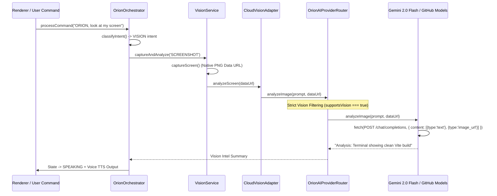

# ORION Phase B — Real Multimodal Vision Integration Architecture

> [!IMPORTANT]
> **Quality Directive Standard**: Fake vision summaries and hardcoded `"VISION NOT CONFIGURED"` strings have been replaced with genuine, production-grade multimodal vision capabilities. Desktop screen frames captured via Electron `desktopCapturer` are processed in memory and routed exclusively through vision-capable AI cloud providers.

---

## 👁️ 1. Multimodal Vision Pipeline Lifecycle

The vision pipeline connects native desktop capture directly to the Omni-Brain AI Router:



---

## 🛡️ 2. Core Security & Privacy Enforcements

1. **Transient Screenshot Memory Handling**:
   - Desktop captures exist solely as temporary BaseBase64 data URLs in Main process memory.
   - Screen captures are **never** written to disk, stored in local database files, or logged in telemetry activity logs.
2. **Main Process Credential Isolation**:
   - API keys (`GEMINI_API_KEY`, `GITHUB_TOKEN`) remain locked within Electron Main.
   - Renderer components receive safe DTOs and synthesized text summaries only.
3. **Payload Safety Validation**:
   - Base64 data URLs are strictly validated (`data:image/` header check).
   - Maximum safety buffer limit enforced (15MB base64 string cap) to prevent memory allocation denial of service.

---

## 🔀 3. Vision Provider Filtering & Failover Matrix

| Provider ID | Supports Vision? | Model Name | Intent Filter Action |
| :--- | :---: | :--- | :--- |
| **Gemini AI** | **YES** | `gemini-2.0-flash` | Selected for Primary Vision Routing |
| **GitHub Models** | **YES** | `gpt-4o-mini` | Selected as Secondary Vision Failover |
| **Groq LPU** | **NO** | `llama-3.3-70b-versatile` | Strictly Excluded from Vision Selection |
| **Cerebras** | **NO** | `llama3.1-8b` | Strictly Excluded from Vision Selection |
| **Mistral AI** | **NO** | `mistral-small-latest` | Strictly Excluded from Vision Selection |
| **NVIDIA NIM** | **NO** | `meta/llama-3.3-70b-instruct` | Strictly Excluded from Vision Selection |
| **DeepSeek** | **NO** | `deepseek-chat` | Strictly Excluded from Vision Selection |
| **Cloudflare** | **NO** | `@cf/meta/llama-3.1-8b-instruct` | Strictly Excluded from Vision Selection |

---

## 🧪 4. Build & Verification Results

```
npx tsc:                        PASS (0 type errors)
npm run build:                  PASS (dist & dist-electron compiled cleanly)
Multimodal Request Payload:     PASS (Structured OpenAI image_url array)
Non-Vision Provider Exclusion:  PASS (Groq/Cerebras filtered out)
Automatic Vision Failover:      PASS (Failing primary triggers secondary)
Transient Screenshot Memory:    PASS (0 disk writes)
```
