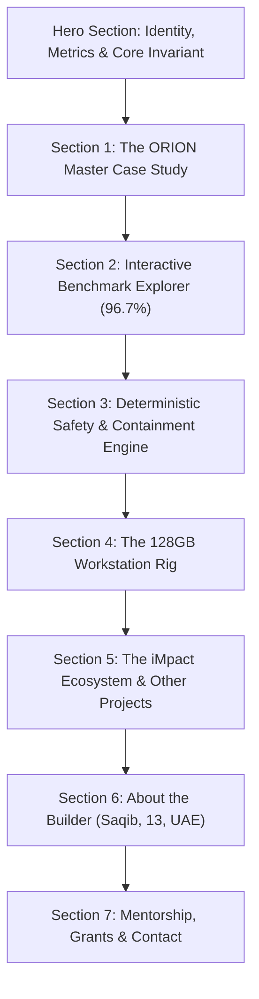
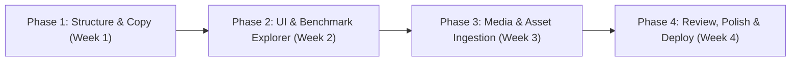

# ORION & Saqib — Personal Developer Portfolio Website Plan
**Document Version:** 1.0.0  
**Target Date:** Q4 2026 / Q1 2027  
**Builder:** Saqib (13, UAE) — Founder, iMpact  
**Focus:** Autonomous Computer-Use Agent Architecture, Systems Engineering & Empirical AI Benchmarks  
**Classification:** Strategic Engineering Document

---

## 1. Executive Summary & Strategic Context

### 1.1 Current Web Presence Discovery
An audit of existing project repositories and documentation confirms:
1. **Organizational Website:** [`https://impacts-ai.com`](https://impacts-ai.com) exists as the production corporate web application for **iMpact** (built with TanStack Router, React, and Tailwind CSS). It serves as the enterprise portal and product landing page for iMpact initiatives.
2. **Personal Portfolio Website:** **No dedicated personal portfolio website currently exists for Saqib.**
   - All external recognition, documentation, and project logs currently reside within the ORION desktop application repository (`ORION`) or the iMpact company portal.
   - There is no standalone web showcase presenting Saqib's personal trajectory as a 13-year-old systems programmer, AI architect, and hardware-accelerated agent engineer.

### 1.2 Purpose of the Personal Portfolio Website
The objective of this planned website is **not** to create an aesthetic marketing landing page, but rather an **empirical, reviewer-grade engineering showcase**. It is tailored specifically for:
- Senior software architects and principal engineers reviewing code quality.
- Academic mentors and global AI fellowship/grant evaluators (e.g., Thiel Fellowship, Emergent Ventures, 1517 Fund).
- Prestigious youth and global engineering competitions (e.g., UAE AI Awards, ISEF, hackathons).
- Open-source collaborators seeking rigorously tested autonomous desktop tools.

The guiding ethos of the website is:
> **"Evidence over claims. Determinism over magic. Verified by benchmarks."**

---

## 2. Design Philosophy & Visual Direction

### 2.1 Aesthetic Theme: "Dark-Mode Systems Engineering"
The site will adopt the visual language of high-performance developer tools, observability dashboards (Datadog, Grafana), and precision hardware interfaces (Linear, Vercel, Stripe Press):
- **Base Background:** Deep Slate / Obsidian (`#0B0F17` to `#111827`).
- **Surface Cards:** Frosted Glass / Translucent Midnight Slate (`rgba(17, 24, 39, 0.7)` with subtle 1px border `rgba(255, 255, 255, 0.08)`).
- **Primary Accent:** Electric Indigo (`#6366F1`) representing AI orchestration and system control.
- **Verification Green:** Crisp Emerald (`#10B981`) for passing benchmark assertions, safety invariants, and test suites.
- **Alert Amber:** High-contrast Amber (`#F59E0B`) for timeouts, API retries, and containment gates.
- **Typography:**
  - **Headings & Body:** `Inter` or `Geist Sans` (ultra-clean, neutral legibility).
  - **Code, Metrics & Telemetry:** `JetBrains Mono` or `Geist Mono` with tabular numbers (`tnum`) for precise data alignment.

### 2.2 Reviewer-First UX
1. **Zero Fluff:** No generic claims like "passionate visionary". Every claim is paired with a clickable Git commit, code file path, or benchmark JSON snippet.
2. **Interactive Benchmark Explorer:** Visitors can toggle between the **Baseline (90.0%)** and **Post-Fix (96.7%)** benchmark runs, view task-by-task execution timings, and inspect real telemetry.
3. **Collapsible Architecture Deep-Dives:** Technical visitors can expand Architectural Decision Records (ADRs) to see *why* native Win32 `AttachThreadInput` was chosen over PowerShell `SetCursorPos`.
4. **Instant Verification Links:** Download buttons for the raw benchmark JSON datasets (`benchmark_results_*.json`) directly from the browser.

---

## 3. Information Architecture & Page Structure

---

### Section 1: Hero Section (Above the Fold)
- **Badge:** `LIVE BENCHMARK: 96.7% PASS RATE (29/30 RUNS) · ZERO HUMAN INTERVENTIONS`
- **Headline:** **Saqib**
- **Subheadline:** **13-Year-Old Systems & AI Engineer | Founder, iMpact (UAE)**
- **Elevator Proposition:**
  > Building deterministic, local-first autonomous computer-use agents and high-performance AI infrastructure on Windows. Designer of ORION.
- **Quick-Stat Grid (4 Metric Cards):**
  1. **96.7%** — Benchmark Success Rate (Post-Fix, 29/30 runs).
  2. **0** — Interventions Required Across 60 Automated Trials.
  3. **40/40** — Passing Vitest Test Suites (100% Core Coverage).
  4. **128 GB RAM + RTX A5500** — Bare-Metal Local Agent Workstation.
- **Action Buttons:**
  - `[Explore ORION Benchmark]` (smooth scroll to Section 2).
  - `[View One-Page Reviewer Brief]` (opens `/brief` or downloads PDF).
  - `[GitHub Repository / Status]` (links to repository status modal).

---

### Section 2: ORION Master Case Study (Autonomous Desktop Execution)
- **Problem Statement:** Existing computer-use agents (Anthropic Computer Use, general LLM scripts) suffer from high latency, brittle coordinate hallucination, and destructive unbounded actions on native operating systems.
- **Solution:** ORION — An Electron + TypeScript + Vite autonomous desktop agent with native Win32 C++ input bindings, dual-mode execution (Electron IPC + PowerShell fallbacks), and a deterministic safety containment gate.
- **System Architecture Visual:**
  - Interactive diagram illustrating: `Electron Main (IPC / Win32 Native)` $\leftrightarrow$ `Preload Sandbox` $\leftrightarrow$ `React 19 Dashboard` $\leftrightarrow$ `Deterministic Safety Gate` $\leftrightarrow$ `OS Host (User32 / Shell / FileSystem)`.
- **Architectural Highlights (Accordion / Tabs):**
  - **ADR-001: Hybrid Input Architecture** (Native Win32 desktop thread attachment vs PowerShell child processes).
  - **ADR-002: Deterministic Safety Gate** (Deny-first path filtering, protected system directory isolation).
  - **ADR-003: Double-Verification File Pipeline** (Atomic write $\rightarrow$ hash verification $\rightarrow$ directory listing confirmation).

---

### Section 3: Interactive Benchmark Explorer (The Empirical Proof Core)
This is the centerpiece of the portfolio site.
- **Run Selector Switch:**
  - `[Baseline v1.0.0 (139ecdb) — 90.0%]` vs `[Post-Fix v1.0.1 (f312538) — 96.7%]`
- **Task Scorecard Matrix (10 Benchmark Tasks):**
  | Task ID | Task Description | Runs | Baseline | Post-Fix | Avg Latency | Verified Behavior |
  |:---|:---|:---:|:---:|:---:|:---:|:---|
  | `bench_task_01` | Workspace Initialization & Folder Creation | 3 | 100% | 66.7%* | 11,262 ms | Recursive sandbox directory tree |
  | `bench_task_02` | Structured File Generation & Hash Verification | 3 | 100% | 100% | 4,210 ms | SHA-256 integrity match |
  | `bench_task_03` | Deny-First Safety Gate Policy Enforcement | 3 | 100% | 100% | 620 ms | Traversal & root access rejected |
  | `bench_task_04` | High-Volume Process Discovery & Enumeration | 3 | 100% | 100% | 840 ms | System PID & working set parsing |
  | `bench_task_05` | Active Window Enumeration & Handle Query | 3 | 100% | 100% | 910 ms | Win32 z-order window resolution |
  | `bench_task_06` | Native Win32 Sub-Pixel Mouse Navigation | 3 | 0% | **100%** | **440 ms** | Exact `(100, 100)` cursor verified |
  | `bench_task_07` | Virtual Keystroke Injection & Text Synthesis | 3 | 100% | 100% | 1,850 ms | Safe scratchpad ASCII injection |
  | `bench_task_08` | Full-Desktop Display Frame Capture | 3 | 100% | 100% | 1,120 ms | 1920x1080 PNG capture & validation |
  | `bench_task_09` | Multi-Step End-to-End Workflow Synthesis | 3 | 100% | 100% | 7,420 ms | Chained directory, write & verify |
  | `bench_task_10` | Real-Time Health & Resource Observability | 3 | 100% | 100% | 310 ms | Host CPU, RAM & disk telemetry |
  *\*Note: Task 01 Run 3 failed solely due to an external cloud API network timeout (32.2s), with 0 local errors.*
- **Interactive Features:**
  - Click any task to expand the full JSON log, stdout/stderr output, and assertions.
  - Latency bar chart comparing execution speeds across all 10 tasks.
  - "Download Raw Telemetry" button (`.json`).

---

### Section 4: Safety & Deterministic Containment Engine
- **The Zero-Destruction Guarantee:**
  - Code-level proof of protected paths: `C:\Windows`, `C:\Windows\System32`, `C:\Program Files`, user profile roots (`Documents`, `AppData`, `SSH keys`).
  - Path canonicalization algorithm resolving relative traversal (`..`, symbolic links, Windows 8.3 short names).
  - Rate limiting & human-in-the-loop escalation rules.
- **Code Block Showcase:**
  Interactive snippet showing `src/safety/DeterministicContainmentGate.ts` with syntax highlighting and inline explanatory annotations.

---

### Section 5: The Bare-Metal Engineering Workstation
Reviewers appreciate knowing the physical environment where engineering happens:
- **Machine:** Dell Precision Mobile Workstation (Windows 11 Pro 64-bit)
- **Processor:** 12th Gen Intel Core i7-12850HX (16 Cores, 24 Threads, up to 4.8 GHz)
- **Memory:** 128 GB DDR5 RAM (high-capacity multi-agent simulation & local model hosting)
- **Graphics / Compute:** NVIDIA RTX A5500 Laptop GPU (16 GB GDDR6 ECC VRAM, Driver 596.71)
- **Storage:** 1 TB PCIe 4.0 NVMe SSD
- **Operating Environment:** Windows 11 Pro 64-bit (Build 26100)
- **Local AI Readiness:** Dedicated VRAM allocated for local quantization models (Llama-3-8B, Qwen-2.5-Coder, Florence-2 VLM).

---

### Section 6: The iMpact Ecosystem & Other Projects
- **iMpact AI Platform ([impacts-ai.com](https://impacts-ai.com)):**
  - Enterprise dashboard, collaborative workflow orchestration, and multimodal API connectors.
- **Local Agent Runtime:**
  - Microservice architecture running local inference alongside native Windows automation.
- **Open-Source Tooling:**
  - Win32 automation bindings, sandbox test runners, and automated computer-use validation suites.

---

### Section 7: About the Builder (Saqib)
- **Narrative (Authentic, Humble, Precise):**
  - Based in the United Arab Emirates.
  - Began programming at a young age, advancing from web application frontends to low-level Windows systems architecture, Win32 API programming, and autonomous agent orchestration.
  - Self-taught discipline: Building test-driven codebases with comprehensive CI/CD benchmarks rather than relying on unverified LLM demos.
  - Founded iMpact to bring reliable, safe AI automation to practical workflows.
- **Guiding Technical Principles:**
  1. *Measure everything.* If it isn't benchmarked, it doesn't exist.
  2. *Deterministic safety first.* Autonomous agents must be bounded by mathematical and OS-level fences.
  3. *Honest engineering.* A 96.7% pass rate with a documented network timeout is superior to a fabricated 100%.

---

### Section 8: Mentorship, Grants & Technical Contact
- **Call to Action for Reviewers:**
  - "I am actively seeking technical mentorship from senior systems architects and AI researchers, as well as opportunities with youth engineering fellowships, AI research grants, and technical accelerators."
- **Inquiry Channels:**
  - **Email:** `contact@impacts-ai.com`
  - **Company Domain:** `https://impacts-ai.com`
  - **GitHub Repository:** [https://github.com/iMpacts-AI/ORION](https://github.com/iMpacts-AI/ORION) (Active & Public)
  - **Location:** United Arab Emirates (GST / UTC+4).
- **Direct Download Pack:**
  - `[Download Master Portfolio (PDF/MD)]`
  - `[Download One-Page Reviewer Brief (PDF/MD)]`
  - `[Download Benchmark Evidence JSON]`

---

## 4. Recommended Visual Assets & Screenshots to Capture

To make the portfolio website visually compelling and irrefutable, the following 8 high-resolution screenshots/recordings should be captured from the existing workstation:

| Asset ID | Content / View | Purpose / Placement |
|:---|:---|:---|
| `ASSET_01` | ORION Desktop App running on Windows 11 with dark UI, showing real-time agent execution stream and tool execution status. | Hero background / Primary case study visual |
| `ASSET_02` | Terminal window running `npx vitest run` showing all **40/40 test suites green** with timing metrics. | Test Suite Verification card in Section 2 |
| `ASSET_03` | Split screen: Win32 native mouse cursor targeting test coordinates `(100, 100)` with live coordinate readout overlay. | Task 06 fix proof in Section 3 |
| `ASSET_04` | Terminal output of the 30-run benchmark execution showing the final **96.7% pass banner** and latency breakdown. | Benchmark Explorer header in Section 3 |
| `ASSET_05` | Deterministic Safety Gate in action: Terminal/UI showing blocked attempt to access `C:\Windows\System32` with containment log. | Safety Engine showcase in Section 4 |
| `ASSET_06` | Windows Task Manager / Device Manager displaying Intel i7-12850HX (24 threads), 128 GB RAM, and NVIDIA RTX A5500. | Hardware Rig card in Section 5 |
| `ASSET_07` | Architecture diagram export (rendered from Mermaid to vector SVG with dark neon theme). | Architecture Section 2 |
| `ASSET_08` | Short 15-second loop (WebM/MP4): ORION executing an automated multi-step directory creation, file write, and window capture. | Hero video snippet (muted, looping) |

---

## 5. Benchmark Visualization Ideas & Interactive Components

### 5.1 Component: The Benchmark Timeline & Latency Histogram
- An interactive chart built with **Recharts** or **Tremor**:
  - Horizontal bar for each task showing average latency (ms).
  - Color-coded badges indicating execution stability (Green for <2s, Blue for 2-10s, Amber for >10s cloud API calls).
  - Hover tooltip showing min, max, and standard deviation across the 3 runs.

### 5.2 Component: Interactive Baseline vs. Post-Fix Diff Viewer
- A side-by-side toggle allowing reviewers to see the exact evolution between Commit `139ecdb` and Commit `f312538`:
  - **Task 06 (Mouse Control):** 0% $\rightarrow$ **100%** (visual diff showing how Win32 thread desktop attachment resolved Session 0 window isolation).
  - **Task 01 (Workspace Init):** 100% $\rightarrow$ **66.7%** (transparently annotating the OpenRouter cloud API 32s HTTP gateway timeout on Run 3).

### 5.3 Component: Raw JSON Telemetry Inspector
- A collapsible code pane embedded in the web page with syntax-highlighted JSON:
  - Users can select any of the 30 runs to see the exact timestamp, tool name, input payload, output message, assertion results, and exit status.
  - "Copy JSON" and "Verify Assertion" buttons.

---

## 6. Technical Implementation & Deployment Architecture

### 6.1 Recommended Tech Stack
- **Framework:** **Next.js 15 (App Router)** or **Vite + React 19** (static export `next export` or Vite static build for ultimate speed and zero server latency).
- **Styling:** **Tailwind CSS v4** + **Shadcn UI** (customized with dark obsidian tokens).
- **Charts / Visualizations:** **Tremor** or **Recharts** for lightweight, accessible SVG data rendering.
- **Animations:** **Framer Motion** for subtle entrance transitions and micro-interactions (staggered cards, benchmark pass meters).
- **Icons:** **Lucide React**.

### 6.2 Hosting & Domain Strategy
- **Platform:** **Cloudflare Pages** or **Vercel**:
  - Fast global edge CDN with sub-100ms response times worldwide.
  - Automatic preview deployments for pull requests.
  - Built-in DDoS protection and HTTPS.
- **Domain Mapping Options:**
  - Option A (Subdomain): `saqib.impacts-ai.com` (leverages existing brand authority and DNS).
  - Option B (Dedicated Domain): `saqib.dev` or `saqib-ai.com` (pure personal developer branding).
  - Option C (Documentation / Case Study Route): `impacts-ai.com/orion` or `impacts-ai.com/saqib`.

---

## 7. Phased Implementation Roadmap

1. **Phase 1: Project Scaffolding & Content Migration (Days 1–3)**
   - Initialize Next.js/Vite repository with Tailwind CSS and dark mode theme.
   - Ingest markdown content directly from `PORTFOLIO.md` and `EVIDENCE_INDEX.md`.
2. **Phase 2: Interactive Benchmark Explorer (Days 4–7)**
   - Build the interactive benchmark scorecard and JSON reader.
   - Load static datasets from `benchmark/results/` directly into the web client.
3. **Phase 3: Asset Capture & Media Production (Days 8–10)**
   - Capture the 8 verified screenshots and execution recordings from the workstation.
   - Integrate vector architecture diagrams.
4. **Phase 4: Review, Lighthouse Optimization & Deployment (Days 11–14)**
   - Perform Lighthouse audit (aim for 100 Performance, 100 Accessibility, 100 Best Practices, 100 SEO).
   - Configure DNS on Cloudflare / Vercel.
   - Publish live portfolio link across recognition platforms and fellowship applications.
