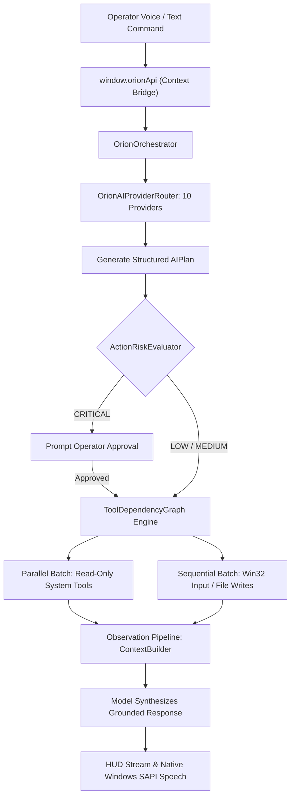

# Project Showcase: ORION (AI Command System & Computer-Use Agent)

**Project Title:** ORION  
**Product Category:** Autonomous Desktop AI Agent & Computer-Use Platform  
**Live URL:** [https://impacts-ai.com/orion](https://impacts-ai.com/orion)  
**Developer:** Saqib (Independent Builder, iMpact)  
**Status:** v1.0.0 Production Baseline (Under Active Development)  

---

## 1. Hero Summary

> **ORION is a desktop-native, permission-based AI agent designed to understand permitted context, formulate structured action plans, execute low-level OS tools, and automate real computer workflows under strict human supervision.**

Trapping AI models in web browser tabs severs them from the operating system where real digital work occurs. ORION brings AI directly onto the desktop: reading per-core CPU and memory telemetry, observing screen context, controlling native Win32 mouse and keyboard inputs, and executing multi-step developer workflows — while giving the operator full authority, visible plans, and an instant Emergency Stop.

---

## 2. The Core Problem

1. **The Web Sandbox Barrier**: Web chatbots cannot inspect local hardware state, search local repositories, or run compilation scripts.
2. **Fragile Cloud Dependencies**: Building on a single commercial AI API means an application crashes whenever rate limits or outages strike.
3. **Runaway Automation Hazards**: Existing experimental computer-use agents often lack deterministic guardrails, making them unsafe for daily workstation use.

---

## 3. The ORION Solution

* **Multi-Tier Electron Architecture**: Clear segregation between Chromium presentation (sandboxed, zero secrets) and Node.js Main process (privileged OS execution).
* **Omnichannel AI Routing Fabric**: 10-provider dynamic gateway (OpenRouter Llama 3.3 70B primary, Groq, Gemini, DeepSeek) with automatic circuit breaking and deterministic offline fallbacks.
* **DAG-Based Tool Engine**: Converts AI plans into dependency graphs, running independent read-only tools concurrently and state-modifying actions sequentially.
* **Defense-in-Depth Governance**: Deterministic path blacklists (`C:\Windows`), human-in-the-loop permission gates, and process-tree SIGKILL Emergency Stop.

---

## 4. Key Architectural Diagrams

---

## 5. Technology Stack

* **Platform & Runtime:** Electron 33.2.1, Node.js v22.23.2
* **Frontend & Presentation:** React 18.3.1, Vite 6.0.5, Tailwind CSS 3.4.17
* **3D Visualizations:** Three.js 0.170.0 (Holographic World Globe HUD)
* **Language & Type Safety:** TypeScript 5.7.2 (Strict mode across all boundaries)
* **Native OS APIs:** Win32 `user32.dll` (P/Invoke), Windows UI Automation COM, PowerShell SAPI Speech
* **Testing Infrastructure:** Custom pure process isolation harness (`run_suites.cjs`)

---

## 6. Verified Evidence & Test Pass Rate

* **Automated Test Suites:** **40 / 40 Passed (100% Green)** in pure process isolation.
* **TypeScript Compilation:** 0 Errors on `npm run build`.
* **Live OpenRouter AI Verification:** Successfully executed live cognitive decision and tool-calling loop with OpenRouter Llama 3.3 70B (`test_brain_full_loop.cjs`).
* **Hardware Profile:** Tested and benchmarked on Dell Precision mobile workstation (Intel Core i7-12850HX, 128 GB RAM, NVIDIA RTX A5500 16 GB VRAM).

---

## 7. Strategic 3-Month Engineering Roadmap

* **Month 1 (October 2026):** Local neural model integration via Ollama (`qwen2.5:14b-instruct`) and local Whisper STT for 100% offline, zero-cost operation.
* **Month 2 (November 2026):** DirectX DXGI screen capture bridge reducing frame acquisition latency to `< 16ms`, and global hardware Estop hotkey (`Ctrl+Alt+Escape`).
* **Month 3 (December 2026):** 50-task automated computer-use benchmark battery achieving `> 90%` autonomous completion reliability.

---

## 8. Limitations & Honest Gaps

* **Visual Perception Latency:** Optical analysis currently relies on cloud multimodal models (Gemini 2.0 Flash), introducing a 2-second round trip.
* **Speech Recognition:** Backend STT provider interface is currently unconfigured; speech transcription relies on browser Web Speech API.
* **Display Scaling:** Win32 click coordinates require manual DPI scaling compensation on high-DPI Windows displays.
