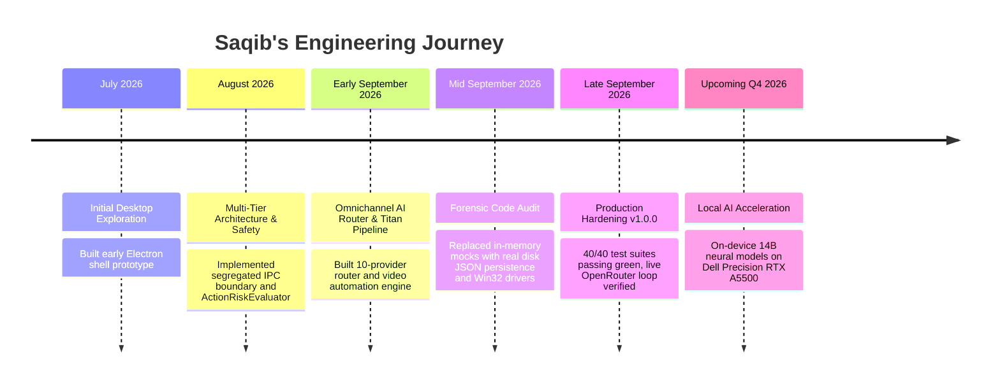

# Developer Portfolio: Saqib

**Builder:** Saqib  
**Role:** Independent Systems & Software Builder  
**Focus:** Native Desktop AI, Computer-Use Systems & Developer Tooling  
**Company Initiative:** iMpact ([https://impacts-ai.com](https://impacts-ai.com))  
**Workstation:** Dell Precision Mobile Workstation (Intel i7-12850HX · 128GB RAM · NVIDIA RTX A5500 16GB)  
**Location:** United Arab Emirates  
**Motto:** *"Ideas are ideas. Implementation is the real deal."*  

---

## 1. About Me

I am a 13-year-old independent software developer based in the UAE. I focus on systems engineering, desktop agents, and local artificial intelligence. 

I don't build surface-level wrappers or follow social media hype. I build software from the ground up: designing multi-tier Electron architectures, interfacing with Win32 P/Invoke drivers, configuring multi-provider AI failover networks, and enforcing deterministic process-tree safety.

My goal is to develop deep, world-class computer science fundamentals through continuous implementation, testing, failure, and mentorship.

---

## 2. Featured Projects

### 1. ORION — Autonomous Permission-Based Desktop AI Computer-Use Agent
* **Role:** Founder, Lead Architect & Developer  
* **Tech Stack:** Electron 33, React 18, TypeScript 5.7, Vite 6, Three.js, Win32 `user32.dll`, Windows UI Automation COM  
* **Overview:** A desktop-native AI assistant designed to operate directly on the operating system. Features an omnichannel 10-provider AI router, DAG-based tool parallelization, native Win32 mouse/keyboard drivers, persistent disk JSON memory, and a process-tree Emergency Stop (`taskkill`).
* **Evidence:** 40/40 automated test suites passing (100% green); clean TypeScript build; verified live OpenRouter Llama 3.3 70B cognitive loop.
* **Documentation:** [ORION Documentation Suite](../docs/) | [Technical Report](ORION-technical-report.md)

### 2. iMpact — Technology Platform & Company Initiative
* **Role:** Founder & Creator  
* **Tech Stack:** TanStack Router, React, Tailwind CSS, Instrument Typography  
* **Live Website:** [https://impacts-ai.com](https://impacts-ai.com)  
* **Overview:** The parent technology initiative hosting ORION and future intelligent systems research. Designed around four core commitments: *Useful before impressive*, *The person stays in command*, *Restraint is a feature*, and *Built to last*. Features full responsive design and bilingual English/Arabic structure.

### 3. Project Titan — Autonomous Video Production Pipeline
* **Role:** System Architect  
* **Tech Stack:** Node.js, FFmpeg, Electron IPC, Cryptographic Validation  
* **Overview:** An integrated domain automation pipeline within ORION that automates video project asset verification, visual planning, voice checking, automated render gating, and release packaging with checksum verification.

---

## 3. Verified Technical Skills

Only skills backed by actual implementation in source code are listed:

* **Programming Languages:** TypeScript (Strict), JavaScript (ES2022+), Python 3.14, PowerShell, HTML5 / CSS3.
* **Desktop & Systems:** Electron (Process Segregation, Context Bridge, IPC Channels), Win32 APIs (`user32.dll` P/Invoke), Windows UI Automation COM, Windows Management Instrumentation (WMI/CIM), Child Process Trees (`spawn`, `exec`, `taskkill`).
* **Frontend & Graphics:** React 18, Vite, Three.js (Holographic 3D Globe Visualizations), Tailwind CSS, Lucide Icons.
* **AI & Language Model Systems:** Multi-Provider AI Architecture, OpenRouter, Groq LPU, Gemini API, GitHub Models, DeepSeek, Cerebras, Streaming SSE Parsers, JSON Function/Tool Calling, Prompt Engineering, DAG Dependency Graphs, Local Model Quantization (GGUF, Q4_K_M).
* **Engineering Practice:** Pure process isolation testing, Architecture Decision Records (ADRs), Semantic Versioning (SemVer), Git version control, defense-in-depth security.

---

## 4. Engineering Journey & Timeline

---

## 5. Technical Evidence & Defensibility

* **GitHub Repository / Codebase:** [ORION Source Code](../src/)
* **Automated Test Evidence:** [docs/testing/testing.md](../docs/testing/testing.md) (40/40 passing suites)
* **Architecture Specifications:** [docs/architecture/architecture.md](../docs/architecture/architecture.md)
* **Live Web Presence:** [https://impacts-ai.com](https://impacts-ai.com)
* **Claim-by-Claim Proof Index:** [reports/audits/evidence-matrix.md](audits/evidence-matrix.md)

---

## 6. Contact & Inquiries

* **Company Website:** [https://impacts-ai.com](https://impacts-ai.com)
* **Inquiries Form:** [https://impacts-ai.com/contact](https://impacts-ai.com/contact)
* **Email:** `contact@impacts-ai.com`
